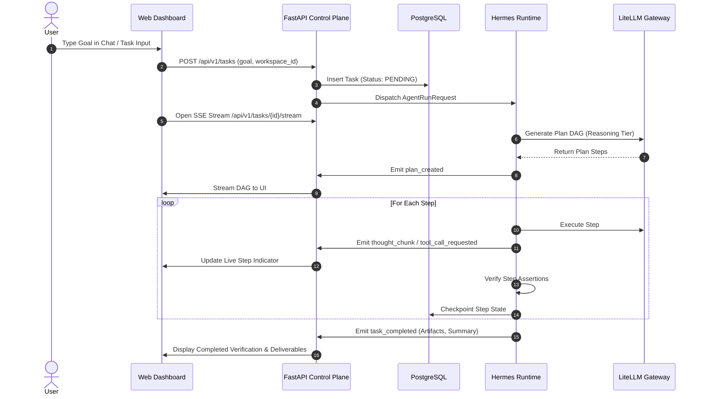

# Application & Interaction Flows (APP_FLOW.md)
## Project Name: AURA (Autonomous Universal Reactive Agent)
**Document Version:** 1.0.0  
**Phase:** Phase 0.5 — Documentation Reconciliation & Consistency Audit  
**Classification:** Canonical User & System Interaction Flows  

---

## 1. Flow Overview & Scope

This document defines the **end-to-end behavioral sequences and state transitions** for all primary user, agent, and system interactions within AURA.

```
+====================================================================================================+
|                                    MASTER FLOW TAXONOMY                                            |
+====================================================================================================+
|  [CORE USER FLOWS]             [AGENT & COGNITIVE FLOWS]          [GOVERNANCE & SYSTEM FLOWS]      |
|  ├── Flow 1: Auth & Workspace   ├── Flow 4: Sub-Agent Delegation   ├── Flow 7: Cron Automation      |
|  ├── Flow 2: Goal Submission    ├── Flow 5: Memory Recall & Write  ├── Flow 8: Webhook Ingress      |
|  └── Flow 3: HITL Approvals     └── Flow 6: Skill Self-Evolution   ├── Flow 9: Emergency Kill Switch|
|                                                                    └── Flow 10: External Chat Pair  |
+====================================================================================================+
```

---

## 2. Detailed Interaction Flows

### Flow 1: User Authentication & Workspace Selection
1. User navigates to Web Dashboard (`/login`).
2. Submits credentials $\rightarrow$ FastAPI validates hash in PostgreSQL $\rightarrow$ Issues JWT Access + Refresh Tokens.
3. User selects active `workspace_id` $\rightarrow$ Client configures Authorization & Workspace headers.
4. Dashboard hydrations load workspace telemetry, active tasks, and pending approvals.

---

### Flow 2: Interactive Goal Submission & Real-Time Execution


---

### Flow 3: Human-in-the-Loop (HITL) High-Risk Tool Approval
1. **Trigger:** Agent proposes a tool marked `risk_level: "high"` or `requires_approval: true` (e.g., `send_email`, `git_push`, `delete_file`).
2. **Suspension:** Agent Runtime suspends step execution and writes a checkpoint to PostgreSQL.
3. **Approval Token:** Control Plane generates an HMAC-SHA256 signed `ApprovalRequest` with parameter hash and a 15-minute TTL.
4. **User Notification:** Dashboard sounds an alert and displays the **Approval Drawer** with side-by-side parameter diffs.
5. **Resolution:**
   * **If Approved:** User clicks "Approve". Frontend sends signed token to `POST /api/v1/approvals/{id}/resolve`. Control Plane verifies signature, updates DB, and signals Runtime to execute the tool with injected credentials.
   * **If Rejected / Expired:** Control Plane transitions task to `REJECTED` or prompts the planner to draft an alternative step.

---

### Flow 4: Hierarchical Sub-Agent Delegation & Synthesis
1. Master Supervisor Agent identifies parallelizable workload (e.g., multi-source market research).
2. Supervisor checks resource limits ($\le 2$ depth, $\le 4$ workers).
3. Supervisor dispatches atomic `SubTaskContract` to Worker Pool (Worker 1: Research, Worker 2: Analysis).
4. Workers execute in isolated context slices with strict token budgets (max 8,000 tokens each).
5. Workers return structured JSON summaries.
6. Master Supervisor aggregates summaries and synthesizes final output without context pollution.

---

### Flow 5: Memory Recall, Ingestion & User Tombstoning
1. **Pre-Turn Recall:** Context Assembler queries Honcho (hybrid BM25 + vector) + PostgreSQL active session messages. Filters out tombstoned facts and injects memory envelope into prompt.
2. **Post-Turn Ingestion:** Background queue processes dialogue, extracts new facts, and updates Honcho peer representation asynchronously.
3. **User Tombstoning:** User views fact in Memory Graph and clicks "Delete". System flags `is_tombstoned = TRUE` in PostgreSQL, deletes vector in Honcho, and injects a negative constraint into future context windows.

---

### Flow 6: Procedural Skill Trigger, Execution & Promotion
1. User goal matches trigger vectors in `skills` catalog (e.g., *"Perform daily executive brief"*).
2. Control Plane loads latest published `SKILL.md` from `skill_versions`.
3. System injects recipe into LLM context; steps execute sequentially with deterministic assertions.
4. **Self-Evolution Gate:** Offline optimizer evaluates telemetry. If an improved prompt recipe is generated, it is saved as `is_published: FALSE` (Draft). An administrator must review the diff in the Web Dashboard and click "Promote to Production".

---

### Flow 7: Scheduled Cron Automation Lifecycle
1. Cron Scheduler daemon polls `automations` table every 60 seconds using `FOR UPDATE SKIP LOCKED`.
2. Due automation is claimed; updates `last_run_at` and computes `next_run_at`.
3. Background task is spawned under **Autonomy Level 3 (L3)**.
4. High-risk side effects are blocked; actions draft pending proposals.
5. Output is delivered to configured delivery targets (Web Dashboard, Telegram, Discord).

---

### Flow 8: Reactive Inbound Webhook Ingress
1. External service (e.g. GitHub, Stripe) sends HTTP POST to `/api/v1/webhooks/ingress/{webhook_id}`.
2. Ingress Gateway validates `X-AURA-Signature` (HMAC-SHA256) and `X-Idempotency-Key`.
3. Automation prompt template is hydrated with webhook payload values.
4. Dispatches task under **Autonomy Level 4 (L4)** in an isolated container sandbox.
5. Emits real-time execution telemetry to Web Dashboard.

---

### Flow 9: Emergency Kill Switch Circuit Breaker
1. User or administrator hits the **Emergency Kill Switch** button in the Web Dashboard or triggers `POST /api/v1/system/kill-switch`.
2. Control Plane immediately publishes a high-priority `SYSTEM_KILL` event to Redis Pub/Sub.
3. All active agent execution threads, subprocesses, and container sandboxes receive `SIGKILL` and terminate within $<500\text{ ms}$.
4. All `PENDING` and `EXECUTING` tasks in PostgreSQL are transitioned to `CANCELLED`.
5. All active ephemeral approval tokens are revoked.

---

### Flow 10: Cross-Platform External Chat Pairing (Telegram/Discord)
1. User opens Web Dashboard $\rightarrow$ Settings $\rightarrow$ Integrations $\rightarrow$ "Connect Telegram".
2. System generates a 6-digit cryptographic pairing code with a 10-minute expiry.
3. User opens AURA Telegram Bot and sends `/pair <code>`.
4. Telegram Ingress Adapter verifies code against PostgreSQL and binds `channel_session_ref` (Chat ID) to the user's canonical `user_id`.
5. Future Telegram messages flow securely into AURA's Ingress API.

---

### Flow 11: Bring-Your-Own-Key (BYOK) Provider Enrollment & Routing Lifecycle

```mermaid
sequenceDiagram
    autonumber
    actor User
    participant Web as Web Dashboard
    participant API as FastAPI Control Plane
    participant Vault as Encrypted Vault
    participant Gemini as Google Gemini API
    participant Ollama as Local Ollama

    Note over User,Web: 1. Credential Enrollment
    User->>Web: Settings -> AI Providers -> "Add Provider (Gemini)"
    User->>Web: Input API Key & Select Model ("gemini-2.5-flash")
    Web->>API: POST /api/v1/credentials (key, provider="gemini")
    API->>Gemini: Validate Key via GET /models
    alt Key Invalid
        Gemini-->>API: 400/401 Unauthorized
        API-->>Web: Error: "Invalid Google Gemini Key"
    else Key Valid
        Gemini-->>API: 200 OK (Model List)
        API->>Vault: Encrypt Key with AES-256-GCM
        Vault-->>API: Ciphertext + Key Fingerprint ("AIza...4f8a")
        API->>API: Persist to DB `credentials` table
        API-->>Web: 201 Created (Key Fingerprint Only; Secret Dropped from Memory)
    end

    Note over User,Web: 2. Task Execution & Smart Routing
    User->>Web: Dispatch High-Complexity Analysis Task
    Web->>API: POST /api/v1/tasks (routing_mode="auto")
    API->>API: Policy Engine checks routing policy & data sensitivity
    alt Private Data Detected OR Policy=LOCAL_ONLY
        API->>Ollama: Execute on Local Qwen 2.5 7B ($0.00)
    else Cloud Permitted & BYOK Configured
        API->>Vault: Decrypt Key in Memory for Outbound Socket
        API->>Gemini: POST /v1beta/models/gemini-2.5-flash:generateContent
        alt Rate Limit (HTTP 429) OR Timeout
            Gemini-->>API: HTTP 429 Quota Exceeded
            API->>Ollama: Automatic Safe Fallback to Local Ollama ($0.00)
            Ollama-->>API: Return Completed Task Output
        else Success
            Gemini-->>API: Streamed Token Response
        end
    end
    API-->>Web: Stream Response & Update Cost Badge
```

