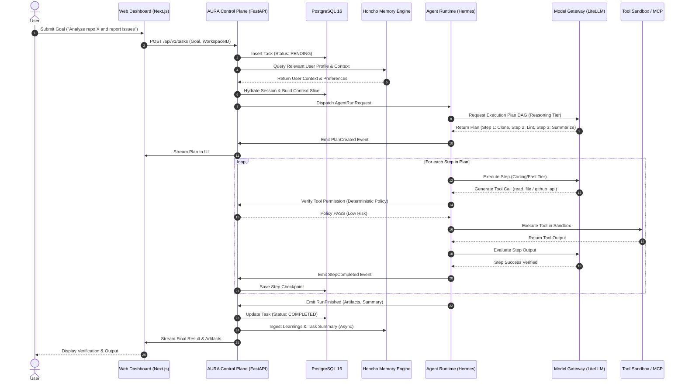
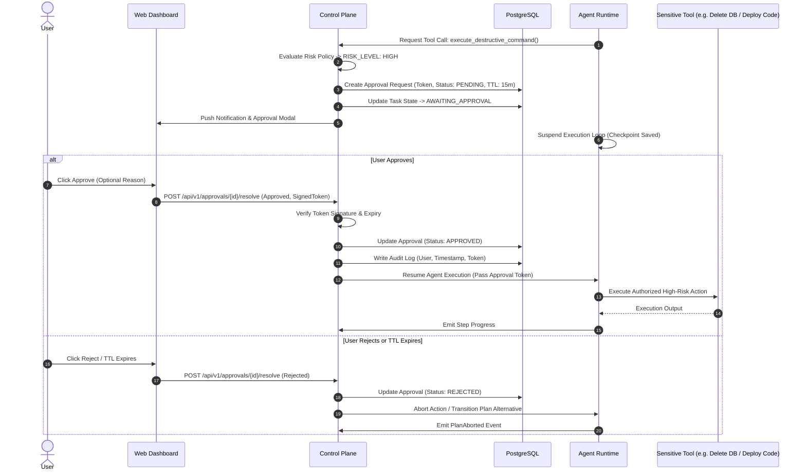
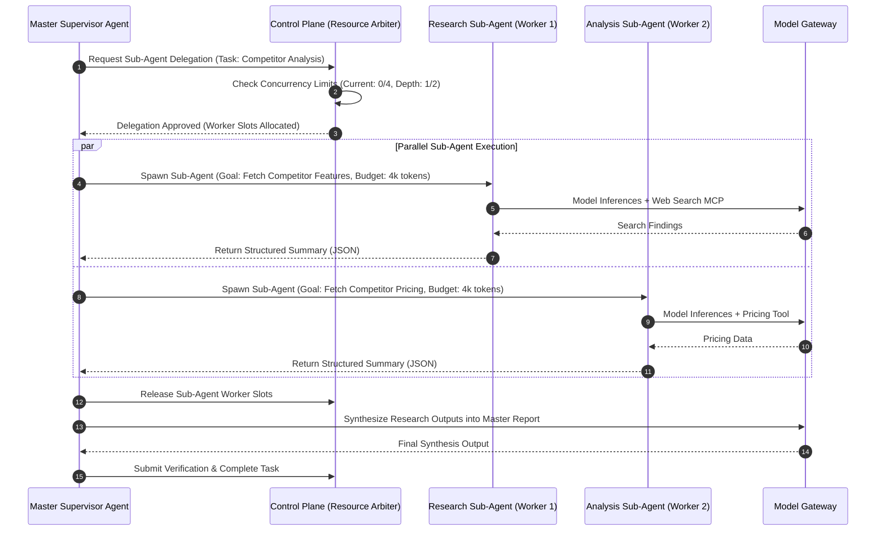

# System Architecture Specification (ARCHITECTURE.md)
## Project Name: AURA (Autonomous Universal Reactive Agent)
**Document Version:** 9.6.0  
**Phase:** Phase 9 — Governed OS & Hardware Automation (COMPLETE & ACCEPTED) | Phase 1–9 Master Validated  
**Classification:** Core System Architecture  

---

## 1. High-Level Architectural Topology

The AURA architecture is structured into four primary logical tiers: **Ingress & Client Tier**, **Control Plane Tier**, **Agent Runtime & Execution Tier**, and **Data & Infrastructure Tier**.

```
+====================================================================================================+
|                                    1. INGRESS & CLIENT TIER                                        |
+====================================================================================================+
|  [Next.js 15 Web Dashboard]  |  [Telegram / Discord Bots]  |  [Webhook Gateway]  |  [CLI Client]   |
+------------------------------+-----------------------------+---------------------+-----------------+
               │                              │                         │                  │
               └──────────────────────────────┼─────────────────────────┴──────────────────┘
                                              ▼ (HTTPS / WSS / gRPC)
+====================================================================================================+
|                                      2. CONTROL PLANE TIER                                         |
+====================================================================================================+
|  +----------------------------------------------------------------------------------------------+  |
|  | API Gateway & Ingress Router (FastAPI / Pydantic v2 / Reverse Proxy)                         |  |
|  +----------------------------------------------------------------------------------------------+  |
|  | Authentication, Authorization & Tenant Isolation (OAuth2, JWT, Scoped API Keys, RBAC)       |  |
|  +----------------------------------------------------------------------------------------------+  |
|  | Deterministic Security Engine (Risk Classification, HITL Approval Gateway, Kill Switch)      |  |
|  +----------------------------------------------------------------------------------------------+  |
|  | Orchestration & Task Manager (Job Queue Broker, Scheduler, Checkpoint Coordinator)          |  |
|  +----------------------------------------------------------------------------------------------+  |
|  | Memory Coordinator & Context Assembler (Postgres Query Builder + FastEmbed Vector Connector)|  |
|  +----------------------------------------------------------------------------------------------+  |
|  | Tool & Skill Registry (Validation Engine, Secret Injector, Schema Exposer)                   |  |
|  +----------------------------------------------------------------------------------------------+  |
|  | Audit & Observability Pipeline (OpenTelemetry Spans, Metrics, Tamper-Evident Audit Ledger)  |  |
|  +----------------------------------------------------------------------------------------------+  |
|  | BYOK Credential Vault (AES-256-GCM Encrypted Storage, Key Fingerprinting, Validation)        |  |
|  +----------------------------------------------------------------------------------------------+  |
|  | Provider-Neutral Model Factory (`ModelProvider`: Ollama Local [Default] | Gemini BYOK [Opt]) |  |
|  +----------------------------------------------------------------------------------------------+  |
+----------------------------------------------------------------------------------------------------+
                                              │
                                              ▼ (Internal RPC / Redis Queue / IPC)
+====================================================================================================+
|                              3. AGENT RUNTIME & EXECUTION TIER                                     |
+====================================================================================================+
|  +----------------------------------------------------------------------------------------------+  |
|  | Agent Runtime Host (Hermes Engine Substrate / Process Supervisor)                            |  |
|  +----------------------------------------------------------------------------------------------+  |
|  | Cognitive Orchestrator (Supervisor / Planner Agent, Plan DAG Generator, Step Evaluator)     |  |
|  +----------------------------------------------------------------------------------------------+  |
|  | Sub-Agent Worker Pool (Research, Coding, Analysis, Synthesis Isolated Workers)              |  |
|  +----------------------------------------------------------------------------------------------+  |
|  | Model Router (`LOCAL_ONLY`, `BYOK_ONLY`, `AUTO` Policies with Safe Local Fallback)           |  |
|  +----------------------------------------------------------------------------------------------+  |
|  | Tool Execution Boundary (MCP Client Manager, stdio/SSE Multiplexer, Sandbox Runner)        |  |
+----------------------------------------------------------------------------------------------------+
                                              │
                                              ▼
+====================================================================================================+
|                                4. DATA & INFRASTRUCTURE TIER                                       |
+====================================================================================================+
|  [PostgreSQL 16 (Relational & pgvector)] |  [Encrypted Credentials Vault] |  [FastEmbed Models]     |
|  [Docker / Firejail Sandboxes]           |  [Local MCP Tool Servers]      |  [Local Ollama Daemon]  |
|  [Optional: Google Gemini BYOK Adapter]  |  [Optional: Cloud Adapters]    |  [Local Redis PubSub]   |
+====================================================================================================+
```

---

## 2. Component Interconnection & Boundaries

### 2.1 Control Plane vs. Agent Runtime Interface
The Control Plane communicates with the Agent Runtime over a strict, structured interface:
* **Input Payload:** An `AgentRunRequest` containing `task_id`, `run_id`, `goal`, `context_slice` (retrieved memories, user preferences, active skill instructions), `allowed_tools` (list of authorized tool JSON schemas), `autonomy_level`, and `budget_limits` (max tokens, max cost, max execution time).
* **Output Stream:** The Agent Runtime streams `AgentRunEvent` objects (PlanCreated, StepStarted, ToolCallRequested, ToolCallExecuted, ThoughtChunk, StepCompleted, RunFinished, RunFailed) back to the Control Plane via internal Redis Pub/Sub and WebSocket streams.
* **Execution Boundary:** When the Agent Runtime encounters a tool call marked `HIGH` or `CRITICAL` risk, it emits a `ToolApprovalRequested` event and yields execution. The Control Plane intercepts the event, transitions the task state in PostgreSQL, and alerts the user.

### 2.2 Memory System Topology
AURA employs a two-tier hybrid memory topology:
1. **System & Relational Memory (PostgreSQL):**
   * Manages absolute ground truth: Users, Workspaces, Sessions, Messages, Task definitions, Execution logs, Audit events, Skill definitions.
   * Performs structured filtering (e.g., retrieve messages for `session_id = X` within date range `Y` filtered by workspace `Z`).
2. **Cognitive & Semantic Memory (PostgreSQL + pgvector + FastEmbed):**
   * Acts as the agent's long-term social cognition and factual recall layer.
   * Extracts user traits, recurring goals, behavioral nuances, and domain-specific knowledge across disparate sessions.
   * Exposes semantic similarity (HNSW vector cosine) and lexical search (PostgreSQL FTS / BM25) over user interactions.
3. **Reconciliation Loop:**
   * Raw conversation turns are written synchronously to PostgreSQL.
   * An asynchronous background worker extracts facts, summaries, and user modeling updates, generating FastEmbed embeddings and persisting to `memory_records`.
   * Before every major planning turn, the Context Assembler queries cognitive memory for top-$K$ relevant memories and injects them into the prompt's memory envelope.

---

## 3. End-to-End Sequence Diagrams

### 3.1 Flow 1: User Goal Submission & Autonomous Multi-Step Execution



---

### 3.2 Flow 2: Human-in-the-Loop (HITL) High-Risk Tool Approval



---

### 3.3 Flow 3: Hierarchical Sub-Agent Delegation



---

## 4. Network Boundaries and Security Enclaves

1. **Public Enclave (DMZ):**
   * Cloudflare / Reverse Proxy terminating TLS 1.3.
   * Rate limiting, DDoS protection, Web Application Firewall (WAF).
   * Only port 443 exposed for HTTPS and WSS traffic to the Web Dashboard and API Gateway.
2. **Control Plane Enclave (Private VPC / Subnet A):**
   * FastAPI Application cluster.
   * Direct connection to PostgreSQL and Redis.
   * Ingress access restricted to DMZ reverse proxy.
3. **Runtime & Sandbox Enclave (Isolated Subnet B):**
   * Agent execution workers.
   * Containerized execution sandboxes (Docker / Firejail).
   * Outbound internet access mediated through an egress proxy with domain allowlisting (preventing data exfiltration to unauthorized IPs).
   * No direct inbound access from the public internet.
4. **Data Enclave (Isolated Subnet C):**
   * PostgreSQL 16 with encrypted storage at rest (AES-256).
   * Redis with TLS and authentication enabled.
   * No public IP addresses. Accessible only by the Control Plane.
