# Database Schema Specification (DATABASE_SCHEMA.md)
## Project Name: AURA (Autonomous Universal Reactive Agent)
**Document Version:** 9.6.0  
**Phase:** Phase 9 — Governed OS & Hardware Automation (COMPLETE & ACCEPTED) | Phase 1–9 Master Validated  
**Classification:** Database Architecture & DDL Specification  

---

## 1. Schema Overview & Design Conventions

* **Engine:** PostgreSQL 16+ with extensions: `uuid-ossp`, `pgcrypto`, `pgvector` (0.7+), and `btree_gist`.
* **Naming Conventions:** All tables, columns, and foreign keys are `snake_case`. Primary keys are typed `UUID` (`DEFAULT gen_random_uuid()`).
* **Timestamp Standard:** All timestamps are `TIMESTAMPTZ` (UTC) with default `CURRENT_TIMESTAMP`.
* **Soft Deletion Standard:** Sensitive entities implement `deleted_at TIMESTAMPTZ NULL`. Queries default to filtering `WHERE deleted_at IS NULL`.
* **Tenant Isolation:** Every top-level entity contains a `workspace_id UUID REFERENCES workspaces(id) ON DELETE CASCADE` with PostgreSQL Row-Level Security (RLS) policies enabled.

---

## 2. Entity-Relationship Diagram (ERD)

```mermaid
erDiagram
    WORKSPACES ||--o{ USERS : contains
    WORKSPACES ||--o{ SESSIONS : scopes
    WORKSPACES ||--o{ TASKS : owns
    WORKSPACES ||--o{ SKILLS : registers
    WORKSPACES ||--o{ TOOLS : governs
    WORKSPACES ||--o{ INTEGRATIONS : configures
    WORKSPACES ||--o{ AUTOMATIONS : schedules
    WORKSPACES ||--o{ AUDIT_LOGS : records
    WORKSPACES ||--o{ PROVIDER_CONFIGURATIONS : manages
    WORKSPACES ||--o{ CREDENTIALS : stores_encrypted
    WORKSPACES ||--o{ MEMORY_RECORDS : stores_facts
    WORKSPACES ||--o{ FILE_RECORDS : catalogs_files
    WORKSPACES ||--o{ FILE_CHUNKS : indexes_vectors
    WORKSPACES ||--o{ FILE_JOBS : tracks_jobs
    WORKSPACES ||--o{ WEBHOOK_ENDPOINTS : registers_webhooks
    WORKSPACES ||--o{ TELEGRAM_INTEGRATIONS : configures_bots

    PROVIDER_CONFIGURATIONS ||--o{ CREDENTIALS : authenticates_with

    SESSIONS ||--o{ MESSAGES : contains
    SESSIONS ||--o{ AGENT_RUNS : spawns

    TASKS ||--o{ TASK_STEPS : decomposes_to
    TASKS ||--o{ AGENT_RUNS : executes_via
    TASKS ||--o{ APPROVAL_REQUESTS : gates

    AGENT_RUNS ||--o{ SUBAGENT_RUNS : delegates
    AGENT_RUNS ||--o{ APPROVAL_REQUESTS : triggers

    SKILLS ||--o{ SKILL_VERSIONS : versions

    TOOLS ||--o{ TOOL_PERMISSIONS : defines_access
    INTEGRATIONS ||--o{ TOOLS : provides

    AUTOMATIONS ||--o{ AUTOMATION_EXECUTIONS : runs

    WEBHOOK_ENDPOINTS ||--o{ WEBHOOK_DELIVERIES : receives

    TELEGRAM_INTEGRATIONS ||--o{ TELEGRAM_PAIRINGS : pairs

    FILE_RECORDS ||--o{ FILE_CHUNKS : splits_into
    FILE_RECORDS ||--o{ FILE_JOBS : executes_jobs
```



---

## 3. Detailed Table Specifications & DDL

### 3.1 Tenancy & Identity

```sql
-- Extensions
CREATE EXTENSION IF NOT EXISTS "uuid-ossp";
CREATE EXTENSION IF NOT EXISTS "pgcrypto";

-- Workspaces (Multi-tenancy boundary)
CREATE TABLE workspaces (
    id UUID PRIMARY KEY DEFAULT gen_random_uuid(),
    name VARCHAR(255) NOT NULL,
    slug VARCHAR(100) UNIQUE NOT NULL,
    description TEXT,
    settings JSONB NOT NULL DEFAULT '{}'::jsonb,
    created_at TIMESTAMPTZ NOT NULL DEFAULT CURRENT_TIMESTAMP,
    updated_at TIMESTAMPTZ NOT NULL DEFAULT CURRENT_TIMESTAMP,
    deleted_at TIMESTAMPTZ NULL
);
CREATE INDEX idx_workspaces_slug ON workspaces(slug);

-- Users
CREATE TABLE users (
    id UUID PRIMARY KEY DEFAULT gen_random_uuid(),
    email VARCHAR(255) UNIQUE NOT NULL,
    password_hash VARCHAR(255) NOT NULL,
    full_name VARCHAR(255) NOT NULL,
    avatar_url TEXT,
    role VARCHAR(50) NOT NULL DEFAULT 'member', -- 'owner', 'admin', 'member', 'read_only'
    is_active BOOLEAN NOT NULL DEFAULT TRUE,
    created_at TIMESTAMPTZ NOT NULL DEFAULT CURRENT_TIMESTAMP,
    updated_at TIMESTAMPTZ NOT NULL DEFAULT CURRENT_TIMESTAMP,
    deleted_at TIMESTAMPTZ NULL
);
CREATE INDEX idx_users_email ON users(email);

-- Workspace Members
CREATE TABLE workspace_members (
    id UUID PRIMARY KEY DEFAULT gen_random_uuid(),
    workspace_id UUID NOT NULL REFERENCES workspaces(id) ON DELETE CASCADE,
    user_id UUID NOT NULL REFERENCES users(id) ON DELETE CASCADE,
    role VARCHAR(50) NOT NULL DEFAULT 'member',
    permissions JSONB NOT NULL DEFAULT '[]'::jsonb,
    created_at TIMESTAMPTZ NOT NULL DEFAULT CURRENT_TIMESTAMP,
    updated_at TIMESTAMPTZ NOT NULL DEFAULT CURRENT_TIMESTAMP,
    CONSTRAINT uq_workspace_user UNIQUE (workspace_id, user_id)
);
CREATE INDEX idx_workspace_members_user ON workspace_members(user_id);
```

### 3.2 Sessions & Messages

```sql
-- Sessions (Conversational / Interactive Ingress)
CREATE TABLE sessions (
    id UUID PRIMARY KEY DEFAULT gen_random_uuid(),
    workspace_id UUID NOT NULL REFERENCES workspaces(id) ON DELETE CASCADE,
    user_id UUID NOT NULL REFERENCES users(id) ON DELETE CASCADE,
    title VARCHAR(255) NOT NULL DEFAULT 'New Conversation',
    channel VARCHAR(50) NOT NULL DEFAULT 'web', -- 'web', 'telegram', 'discord', 'cli', 'voice'
    channel_session_ref VARCHAR(255), -- External platform chat ID
    status VARCHAR(50) NOT NULL DEFAULT 'active', -- 'active', 'archived', 'paused'
    metadata JSONB NOT NULL DEFAULT '{}'::jsonb,
    created_at TIMESTAMPTZ NOT NULL DEFAULT CURRENT_TIMESTAMP,
    updated_at TIMESTAMPTZ NOT NULL DEFAULT CURRENT_TIMESTAMP,
    deleted_at TIMESTAMPTZ NULL
);
CREATE INDEX idx_sessions_workspace ON sessions(workspace_id);
CREATE INDEX idx_sessions_user ON sessions(user_id);
CREATE INDEX idx_sessions_channel_ref ON sessions(channel, channel_session_ref);

-- Messages
CREATE TABLE messages (
    id UUID PRIMARY KEY DEFAULT gen_random_uuid(),
    session_id UUID NOT NULL REFERENCES sessions(id) ON DELETE CASCADE,
    workspace_id UUID NOT NULL REFERENCES workspaces(id) ON DELETE CASCADE,
    sender_type VARCHAR(50) NOT NULL, -- 'user', 'agent', 'system', 'tool'
    sender_id VARCHAR(255), -- user_id or agent_run_id or tool_name
    role VARCHAR(50) NOT NULL, -- 'user', 'assistant', 'system', 'tool'
    content TEXT NOT NULL,
    tokens_consumed INTEGER DEFAULT 0,
    model_name VARCHAR(100),
    metadata JSONB NOT NULL DEFAULT '{}'::jsonb, -- attachments, citations, tool_call_id
    created_at TIMESTAMPTZ NOT NULL DEFAULT CURRENT_TIMESTAMP
);
CREATE INDEX idx_messages_session ON messages(session_id, created_at ASC);
CREATE INDEX idx_messages_workspace ON messages(workspace_id);
```

### 3.3 Tasks, Agent Runs & Sub-Agents

```sql
-- Tasks (High-Level User Goals & Background Automations)
CREATE TABLE tasks (
    id UUID PRIMARY KEY DEFAULT gen_random_uuid(),
    workspace_id UUID NOT NULL REFERENCES workspaces(id) ON DELETE CASCADE,
    created_by UUID REFERENCES users(id) ON DELETE SET NULL,
    session_id UUID REFERENCES sessions(id) ON DELETE SET NULL,
    title VARCHAR(255) NOT NULL,
    goal TEXT NOT NULL,
    status VARCHAR(50) NOT NULL DEFAULT 'pending', -- 'pending', 'scheduled', 'planning', 'executing', 'awaiting_approval', 'verifying', 'completed', 'failed', 'cancelled', 'rejected'
    priority VARCHAR(20) NOT NULL DEFAULT 'medium', -- 'low', 'medium', 'high', 'urgent'
    autonomy_level SMALLINT NOT NULL DEFAULT 2, -- 0 to 5
    budget_max_tokens INTEGER NOT NULL DEFAULT 100000,
    budget_max_cost_cents INTEGER NOT NULL DEFAULT 500, -- in USD cents ($5.00)
    timeout_seconds INTEGER NOT NULL DEFAULT 1800, -- 30 minutes
    idempotency_key VARCHAR(255) UNIQUE,
    error_summary TEXT,
    result_summary TEXT,
    created_at TIMESTAMPTZ NOT NULL DEFAULT CURRENT_TIMESTAMP,
    updated_at TIMESTAMPTZ NOT NULL DEFAULT CURRENT_TIMESTAMP,
    completed_at TIMESTAMPTZ NULL,
    deleted_at TIMESTAMPTZ NULL
);
CREATE INDEX idx_tasks_workspace_status ON tasks(workspace_id, status);
CREATE INDEX idx_tasks_created_at ON tasks(created_at DESC);

-- Task Steps (Discrete Plan DAG Items)
CREATE TABLE task_steps (
    id UUID PRIMARY KEY DEFAULT gen_random_uuid(),
    task_id UUID NOT NULL REFERENCES tasks(id) ON DELETE CASCADE,
    step_number INTEGER NOT NULL,
    title VARCHAR(255) NOT NULL,
    description TEXT NOT NULL,
    dependencies JSONB NOT NULL DEFAULT '[]'::jsonb, -- Array of parent step_numbers
    status VARCHAR(50) NOT NULL DEFAULT 'pending', -- 'pending', 'in_progress', 'completed', 'failed', 'skipped'
    tool_name VARCHAR(100),
    tool_input JSONB,
    tool_output JSONB,
    verification_assertions JSONB NOT NULL DEFAULT '[]'::jsonb,
    is_verified BOOLEAN NOT NULL DEFAULT FALSE,
    started_at TIMESTAMPTZ,
    completed_at TIMESTAMPTZ,
    error_message TEXT,
    CONSTRAINT uq_task_step_number UNIQUE (task_id, step_number)
);
CREATE INDEX idx_task_steps_task ON task_steps(task_id, step_number ASC);

-- Agent Runs (Execution Instances of the Agent Runtime)
CREATE TABLE agent_runs (
    id UUID PRIMARY KEY DEFAULT gen_random_uuid(),
    task_id UUID REFERENCES tasks(id) ON DELETE CASCADE,
    session_id UUID REFERENCES sessions(id) ON DELETE SET NULL,
    workspace_id UUID NOT NULL REFERENCES workspaces(id) ON DELETE CASCADE,
    agent_type VARCHAR(50) NOT NULL DEFAULT 'master_supervisor', -- 'master_supervisor', 'subagent'
    model_name VARCHAR(100) NOT NULL,
    model_tier VARCHAR(50) NOT NULL, -- 'reasoning', 'fast', 'coding', 'local'
    status VARCHAR(50) NOT NULL DEFAULT 'running', -- 'running', 'paused', 'completed', 'failed', 'killed'
    total_tokens_in INTEGER NOT NULL DEFAULT 0,
    total_tokens_out INTEGER NOT NULL DEFAULT 0,
    total_cost_cents NUMERIC(10, 4) NOT NULL DEFAULT 0.0000,
    duration_ms INTEGER DEFAULT 0,
    checkpoint_state JSONB NOT NULL DEFAULT '{}'::jsonb,
    started_at TIMESTAMPTZ NOT NULL DEFAULT CURRENT_TIMESTAMP,
    ended_at TIMESTAMPTZ
);
CREATE INDEX idx_agent_runs_task ON agent_runs(task_id);
CREATE INDEX idx_agent_runs_workspace ON agent_runs(workspace_id);

-- Sub-Agent Runs (Hierarchical Delegated Workers)
CREATE TABLE subagent_runs (
    id UUID PRIMARY KEY DEFAULT gen_random_uuid(),
    parent_run_id UUID NOT NULL REFERENCES agent_runs(id) ON DELETE CASCADE,
    task_id UUID NOT NULL REFERENCES tasks(id) ON DELETE CASCADE,
    role VARCHAR(50) NOT NULL, -- 'researcher', 'coder', 'analyzer', 'synthesizer'
    goal TEXT NOT NULL,
    assigned_budget_tokens INTEGER NOT NULL,
    consumed_tokens INTEGER NOT NULL DEFAULT 0,
    depth_level SMALLINT NOT NULL DEFAULT 1, -- Max: 2
    status VARCHAR(50) NOT NULL DEFAULT 'running',
    result_payload JSONB,
    started_at TIMESTAMPTZ NOT NULL DEFAULT CURRENT_TIMESTAMP,
    ended_at TIMESTAMPTZ
);
CREATE INDEX idx_subagent_parent ON subagent_runs(parent_run_id);
```

### 3.4 Tools, Skills & Integrations

```sql
-- Integrations (Connected Third-Party Services / MCP Providers)
CREATE TABLE integrations (
    id UUID PRIMARY KEY DEFAULT gen_random_uuid(),
    workspace_id UUID NOT NULL REFERENCES workspaces(id) ON DELETE CASCADE,
    name VARCHAR(100) NOT NULL,
    provider_type VARCHAR(50) NOT NULL, -- 'mcp_server', 'oauth_github', 'google_calendar', 'tavily_search', 'local_fs'
    transport VARCHAR(50) NOT NULL DEFAULT 'native', -- 'native', 'mcp_stdio', 'mcp_sse'
    endpoint_url TEXT,
    config JSONB NOT NULL DEFAULT '{}'::jsonb,
    encrypted_credentials BYTEA, -- AES-256-GCM encrypted
    status VARCHAR(50) NOT NULL DEFAULT 'active', -- 'active', 'disconnected', 'error'
    created_at TIMESTAMPTZ NOT NULL DEFAULT CURRENT_TIMESTAMP,
    updated_at TIMESTAMPTZ NOT NULL DEFAULT CURRENT_TIMESTAMP,
    deleted_at TIMESTAMPTZ NULL
);
CREATE INDEX idx_integrations_workspace ON integrations(workspace_id);

-- Tools (Registered Atomic Capabilities)
CREATE TABLE tools (
    id UUID PRIMARY KEY DEFAULT gen_random_uuid(),
    workspace_id UUID REFERENCES workspaces(id) ON DELETE CASCADE, -- NULL = Global System Tool
    integration_id UUID REFERENCES integrations(id) ON DELETE CASCADE,
    name VARCHAR(100) UNIQUE NOT NULL,
    display_name VARCHAR(255) NOT NULL,
    description TEXT NOT NULL,
    category VARCHAR(50) NOT NULL, -- 'web', 'code', 'file', 'comms', 'database', 'system'
    risk_level VARCHAR(20) NOT NULL DEFAULT 'low', -- 'low', 'medium', 'high', 'critical'
    input_schema JSONB NOT NULL, -- JSON Schema compliant
    output_schema JSONB NOT NULL,
    timeout_seconds INTEGER NOT NULL DEFAULT 30,
    rate_limit_per_minute INTEGER NOT NULL DEFAULT 60,
    requires_approval BOOLEAN NOT NULL DEFAULT FALSE,
    is_allowed_in_background BOOLEAN NOT NULL DEFAULT TRUE,
    is_active BOOLEAN NOT NULL DEFAULT TRUE,
    created_at TIMESTAMPTZ NOT NULL DEFAULT CURRENT_TIMESTAMP,
    updated_at TIMESTAMPTZ NOT NULL DEFAULT CURRENT_TIMESTAMP
);
CREATE INDEX idx_tools_name ON tools(name);
CREATE INDEX idx_tools_risk ON tools(risk_level);

-- Skills (Procedural Multi-Step Workflows)
CREATE TABLE skills (
    id UUID PRIMARY KEY DEFAULT gen_random_uuid(),
    workspace_id UUID REFERENCES workspaces(id) ON DELETE CASCADE,
    name VARCHAR(100) NOT NULL,
    slug VARCHAR(100) NOT NULL,
    category VARCHAR(50) NOT NULL,
    description TEXT NOT NULL,
    is_system_skill BOOLEAN NOT NULL DEFAULT FALSE,
    is_active BOOLEAN NOT NULL DEFAULT TRUE,
    created_at TIMESTAMPTZ NOT NULL DEFAULT CURRENT_TIMESTAMP,
    updated_at TIMESTAMPTZ NOT NULL DEFAULT CURRENT_TIMESTAMP,
    deleted_at TIMESTAMPTZ NULL,
    CONSTRAINT uq_skill_slug_workspace UNIQUE (slug, workspace_id)
);

-- Skill Versions (Immutable Version History)
CREATE TABLE skill_versions (
    id UUID PRIMARY KEY DEFAULT gen_random_uuid(),
    skill_id UUID NOT NULL REFERENCES skills(id) ON DELETE CASCADE,
    version_semver VARCHAR(20) NOT NULL, -- '1.0.0', '1.1.0'
    instruction_markdown TEXT NOT NULL, -- SKILL.md body
    required_tools JSONB NOT NULL DEFAULT '[]'::jsonb, -- Array of tool names
    preconditions JSONB NOT NULL DEFAULT '[]'::jsonb,
    trigger_phrases JSONB NOT NULL DEFAULT '[]'::jsonb,
    is_published BOOLEAN NOT NULL DEFAULT TRUE,
    created_at TIMESTAMPTZ NOT NULL DEFAULT CURRENT_TIMESTAMP,
    CONSTRAINT uq_skill_version UNIQUE (skill_id, version_semver)
);
```

### 3.5 Security, Approvals & Audit Ledger

```sql
-- Approval Requests (Human-In-The-Loop Enforcement)
CREATE TABLE approval_requests (
    id UUID PRIMARY KEY DEFAULT gen_random_uuid(),
    workspace_id UUID NOT NULL REFERENCES workspaces(id) ON DELETE CASCADE,
    task_id UUID NOT NULL REFERENCES tasks(id) ON DELETE CASCADE,
    agent_run_id UUID NOT NULL REFERENCES agent_runs(id) ON DELETE CASCADE,
    tool_name VARCHAR(100) NOT NULL,
    tool_params JSONB NOT NULL,
    risk_level VARCHAR(20) NOT NULL,
    status VARCHAR(50) NOT NULL DEFAULT 'pending', -- 'pending', 'approved', 'rejected', 'expired'
    approval_token_hash VARCHAR(255) NOT NULL,
    reason_requested TEXT,
    resolved_by UUID REFERENCES users(id) ON DELETE SET NULL,
    resolution_notes TEXT,
    expires_at TIMESTAMPTZ NOT NULL,
    created_at TIMESTAMPTZ NOT NULL DEFAULT CURRENT_TIMESTAMP,
    resolved_at TIMESTAMPTZ NULL
);
CREATE INDEX idx_approval_status ON approval_requests(workspace_id, status);
CREATE INDEX idx_approval_expiry ON approval_requests(expires_at) WHERE status = 'pending';

-- Audit Logs (Tamper-Evident Immutable Ledger)
CREATE TABLE audit_logs (
    id BIGSERIAL PRIMARY KEY,
    workspace_id UUID NOT NULL REFERENCES workspaces(id) ON DELETE CASCADE,
    actor_type VARCHAR(50) NOT NULL, -- 'user', 'agent', 'system'
    actor_id VARCHAR(255) NOT NULL,
    action VARCHAR(100) NOT NULL, -- 'tool_executed', 'approval_granted', 'task_cancelled', 'secret_accessed'
    resource_type VARCHAR(100) NOT NULL,
    resource_id VARCHAR(255) NOT NULL,
    details JSONB NOT NULL DEFAULT '{}'::jsonb,
    ip_address INET,
    previous_log_hash VARCHAR(64) NOT NULL, -- SHA-256 hash chaining
    log_hash VARCHAR(64) NOT NULL, -- SHA-256 of (id + timestamp + details + previous_log_hash)
    created_at TIMESTAMPTZ NOT NULL DEFAULT CURRENT_TIMESTAMP
);
CREATE INDEX idx_audit_workspace ON audit_logs(workspace_id, created_at DESC);
CREATE INDEX idx_audit_action ON audit_logs(action);
```

### 3.6 Automations & Memory Metadata

```sql
-- Automations (Cron & Event Trigger Configurations)
CREATE TABLE automations (
    id UUID PRIMARY KEY DEFAULT gen_random_uuid(),
    workspace_id UUID NOT NULL REFERENCES workspaces(id) ON DELETE CASCADE,
    created_by UUID REFERENCES users(id) ON DELETE SET NULL,
    name VARCHAR(255) NOT NULL,
    trigger_type VARCHAR(50) NOT NULL, -- 'cron', 'webhook', 'event'
    cron_expression VARCHAR(100), -- e.g. '0 7 * * *'
    webhook_secret VARCHAR(255),
    event_pattern JSONB,
    prompt_template TEXT NOT NULL,
    assigned_skill_id UUID REFERENCES skills(id) ON DELETE SET NULL,
    autonomy_level SMALLINT NOT NULL DEFAULT 3,
    is_active BOOLEAN NOT NULL DEFAULT TRUE,
    last_run_at TIMESTAMPTZ,
    next_run_at TIMESTAMPTZ,
    total_runs INTEGER NOT NULL DEFAULT 0,
    total_failures INTEGER NOT NULL DEFAULT 0,
    created_at TIMESTAMPTZ NOT NULL DEFAULT CURRENT_TIMESTAMP,
    updated_at TIMESTAMPTZ NOT NULL DEFAULT CURRENT_TIMESTAMP,
    deleted_at TIMESTAMPTZ NULL
);
CREATE INDEX idx_automations_next_run ON automations(next_run_at) WHERE is_active = TRUE;

-- Memory Records (Cognitive Memory with 768-dim Vector Embeddings & Structured Provenance)
CREATE TABLE memory_records (
    id UUID PRIMARY KEY DEFAULT gen_random_uuid(),
    workspace_id UUID NOT NULL REFERENCES workspaces(id) ON DELETE CASCADE,
    user_id UUID REFERENCES users(id) ON DELETE CASCADE,
    category VARCHAR(50) NOT NULL, -- 'preference', 'project_context', 'personal_fact', 'skill_learning', 'file_insight'
    source_type VARCHAR(50) NOT NULL DEFAULT 'user_directive', -- 'user_directive', 'file_intelligence', 'extracted_fact', 'system_event'
    fact_statement TEXT NOT NULL,
    confidence_score NUMERIC(4, 3) NOT NULL DEFAULT 1.000,
    embedding vector(768),
    provenance JSONB NOT NULL DEFAULT '{}'::jsonb, -- Structured provenance {workspace_id, file_id, chunk_id, chunk_index, source_location, file_sha256, parser_version, chunking_version, embedding_model, retrieval_score, timestamp}
    is_tombstoned BOOLEAN NOT NULL DEFAULT FALSE,
    tombstoned_reason TEXT,
    created_at TIMESTAMPTZ NOT NULL DEFAULT CURRENT_TIMESTAMP,
    updated_at TIMESTAMPTZ NOT NULL DEFAULT CURRENT_TIMESTAMP,
    deleted_at TIMESTAMPTZ
);
CREATE INDEX idx_memory_workspace_cat ON memory_records(workspace_id, category) WHERE is_tombstoned = FALSE;
CREATE INDEX idx_memory_records_hnsw ON memory_records USING hnsw (embedding vector_cosine_ops) WHERE is_tombstoned = FALSE;
CREATE INDEX idx_memory_records_provenance_file ON memory_records ((provenance->>'file_id')) WHERE provenance->>'file_id' IS NOT NULL;
```

### 3.7 Model Provider Configurations & Encrypted BYOK Credentials

```sql
-- Model Provider Configurations (Ollama Local, Gemini BYOK, OpenAI, Anthropic)
CREATE TABLE provider_configurations (
    id UUID PRIMARY KEY DEFAULT gen_random_uuid(),
    workspace_id UUID NOT NULL REFERENCES workspaces(id) ON DELETE CASCADE,
    provider_type VARCHAR(50) NOT NULL, -- 'ollama', 'gemini', 'openai', 'anthropic'
    display_name VARCHAR(100) NOT NULL,
    is_enabled BOOLEAN NOT NULL DEFAULT TRUE,
    is_default BOOLEAN NOT NULL DEFAULT FALSE,
    routing_mode VARCHAR(30) NOT NULL DEFAULT 'local_only', -- 'local_only', 'byok_only', 'auto'
    default_model VARCHAR(100) NOT NULL, -- e.g. 'qwen2.5:7b', 'gemini-2.5-flash', 'gemini-2.5-pro'
    api_endpoint VARCHAR(255) NOT NULL, -- e.g. 'http://localhost:11434', 'https://generativelanguage.googleapis.com/v1beta'
    config_options JSONB NOT NULL DEFAULT '{}'::jsonb, -- timeout_seconds, max_tokens, temperature, context_window, rate_limit_rpm
    billing_tier VARCHAR(50) NOT NULL DEFAULT 'zero_cost_local', -- 'zero_cost_local', 'byok_free_tier', 'byok_potentially_billable'
    created_at TIMESTAMPTZ NOT NULL DEFAULT CURRENT_TIMESTAMP,
    updated_at TIMESTAMPTZ NOT NULL DEFAULT CURRENT_TIMESTAMP,
    deleted_at TIMESTAMPTZ NULL,
    CONSTRAINT uq_workspace_provider_type UNIQUE(workspace_id, provider_type)
);
CREATE INDEX idx_provider_configs_ws ON provider_configurations(workspace_id, is_enabled) WHERE deleted_at IS NULL;

-- Encrypted Credentials Vault (Never stored in plaintext; master key resides outside DB)
CREATE TABLE credentials (
    id UUID PRIMARY KEY DEFAULT gen_random_uuid(),
    workspace_id UUID NOT NULL REFERENCES workspaces(id) ON DELETE CASCADE,
    provider_config_id UUID NOT NULL REFERENCES provider_configurations(id) ON DELETE CASCADE,
    credential_type VARCHAR(50) NOT NULL, -- 'api_key', 'oauth_token', 'service_account_json'
    encrypted_secret TEXT NOT NULL, -- AES-256-GCM ciphertext + IV + auth tag (Base64 encoded)
    key_fingerprint VARCHAR(64) NOT NULL, -- SHA-256 prefix/hash for UI display without secret disclosure (e.g. 'AIza...4f8a')
    is_valid BOOLEAN NOT NULL DEFAULT TRUE,
    last_validated_at TIMESTAMPTZ,
    last_validation_error TEXT,
    expires_at TIMESTAMPTZ,
    created_at TIMESTAMPTZ NOT NULL DEFAULT CURRENT_TIMESTAMP,
    updated_at TIMESTAMPTZ NOT NULL DEFAULT CURRENT_TIMESTAMP,
    CONSTRAINT uq_provider_credential UNIQUE(provider_config_id, credential_type)
);
CREATE INDEX idx_credentials_ws ON credentials(workspace_id);
CREATE INDEX idx_credentials_provider ON credentials(provider_config_id);

-- Webhook Ingress Gateway Tables
CREATE TABLE webhook_endpoints (
    id UUID PRIMARY KEY DEFAULT gen_random_uuid(),
    workspace_id UUID NOT NULL REFERENCES workspaces(id) ON DELETE CASCADE,
    created_by UUID REFERENCES users(id) ON DELETE SET NULL,
    public_id VARCHAR(64) UNIQUE NOT NULL,
    name VARCHAR(255) NOT NULL,
    description TEXT,
    secret_ciphertext TEXT NOT NULL,
    prompt_template TEXT NOT NULL,
    autonomy_level SMALLINT NOT NULL DEFAULT 4,
    is_active BOOLEAN NOT NULL DEFAULT TRUE,
    max_payload_bytes INTEGER NOT NULL DEFAULT 1048576,
    rate_limit_per_minute INTEGER NOT NULL DEFAULT 60,
    last_received_at TIMESTAMPTZ,
    total_received INTEGER NOT NULL DEFAULT 0,
    total_failed INTEGER NOT NULL DEFAULT 0,
    created_at TIMESTAMPTZ NOT NULL DEFAULT CURRENT_TIMESTAMP,
    updated_at TIMESTAMPTZ NOT NULL DEFAULT CURRENT_TIMESTAMP,
    deleted_at TIMESTAMPTZ
);
CREATE INDEX ix_webhook_endpoints_workspace_id ON webhook_endpoints(workspace_id);
CREATE INDEX ix_webhook_endpoints_public_id ON webhook_endpoints(public_id);
CREATE INDEX ix_webhook_endpoints_is_active ON webhook_endpoints(is_active);
CREATE INDEX ix_webhook_endpoints_workspace_active ON webhook_endpoints(workspace_id, is_active);

CREATE TABLE webhook_deliveries (
    id UUID PRIMARY KEY DEFAULT gen_random_uuid(),
    webhook_endpoint_id UUID NOT NULL REFERENCES webhook_endpoints(id) ON DELETE CASCADE,
    workspace_id UUID NOT NULL REFERENCES workspaces(id) ON DELETE CASCADE,
    idempotency_key VARCHAR(255) NOT NULL,
    received_at TIMESTAMPTZ NOT NULL DEFAULT CURRENT_TIMESTAMP,
    status VARCHAR(50) NOT NULL DEFAULT 'accepted',
    task_id UUID REFERENCES tasks(id) ON DELETE SET NULL,
    payload_hash VARCHAR(64) NOT NULL,
    error_code VARCHAR(100),
    error_summary TEXT,
    created_at TIMESTAMPTZ NOT NULL DEFAULT CURRENT_TIMESTAMP,
    updated_at TIMESTAMPTZ NOT NULL DEFAULT CURRENT_TIMESTAMP,
    CONSTRAINT uq_webhook_delivery_idempotency UNIQUE (workspace_id, webhook_endpoint_id, idempotency_key)
);
CREATE INDEX ix_webhook_deliveries_webhook_endpoint_id ON webhook_deliveries(webhook_endpoint_id);
CREATE INDEX ix_webhook_deliveries_workspace_id ON webhook_deliveries(workspace_id);
CREATE INDEX ix_webhook_deliveries_idempotency_key ON webhook_deliveries(idempotency_key);
CREATE INDEX ix_webhook_deliveries_status ON webhook_deliveries(status);

-- Telegram Bot Integration Tables
CREATE TABLE telegram_integrations (
    id UUID PRIMARY KEY DEFAULT gen_random_uuid(),
    workspace_id UUID NOT NULL REFERENCES workspaces(id) ON DELETE CASCADE,
    created_by UUID REFERENCES users(id) ON DELETE SET NULL,
    display_name VARCHAR(255) NOT NULL DEFAULT 'Telegram Bot',
    bot_token_ciphertext TEXT NOT NULL,
    bot_username VARCHAR(255),
    bot_id VARCHAR(64),
    is_active BOOLEAN NOT NULL DEFAULT TRUE,
    polling_state VARCHAR(50) NOT NULL DEFAULT 'stopped',
    last_update_id BIGINT NOT NULL DEFAULT 0,
    poller_lease_id VARCHAR(255),
    poller_lease_expires_at TIMESTAMPTZ,
    last_successful_poll_at TIMESTAMPTZ,
    last_error_code VARCHAR(100),
    last_error_summary TEXT,
    total_messages_received INTEGER NOT NULL DEFAULT 0,
    total_commands_processed INTEGER NOT NULL DEFAULT 0,
    created_at TIMESTAMPTZ NOT NULL DEFAULT CURRENT_TIMESTAMP,
    updated_at TIMESTAMPTZ NOT NULL DEFAULT CURRENT_TIMESTAMP,
    deleted_at TIMESTAMPTZ
);
CREATE INDEX ix_telegram_integrations_workspace_id ON telegram_integrations(workspace_id);
CREATE INDEX ix_telegram_integrations_is_active ON telegram_integrations(is_active);
CREATE INDEX ix_telegram_integrations_workspace_active ON telegram_integrations(workspace_id, is_active);
CREATE INDEX ix_telegram_integrations_lease ON telegram_integrations(is_active, poller_lease_expires_at);

CREATE TABLE telegram_pairings (
    id UUID PRIMARY KEY DEFAULT gen_random_uuid(),
    workspace_id UUID NOT NULL REFERENCES workspaces(id) ON DELETE CASCADE,
    integration_id UUID NOT NULL REFERENCES telegram_integrations(id) ON DELETE CASCADE,
    created_by UUID REFERENCES users(id) ON DELETE SET NULL,
    telegram_chat_id VARCHAR(64) NOT NULL,
    telegram_user_id VARCHAR(64),
    telegram_username VARCHAR(255),
    is_active BOOLEAN NOT NULL DEFAULT FALSE,
    pairing_token_hash VARCHAR(64),
    pairing_token_expires_at TIMESTAMPTZ,
    paired_at TIMESTAMPTZ,
    revoked_at TIMESTAMPTZ,
    last_seen_at TIMESTAMPTZ,
    created_at TIMESTAMPTZ NOT NULL DEFAULT CURRENT_TIMESTAMP,
    updated_at TIMESTAMPTZ NOT NULL DEFAULT CURRENT_TIMESTAMP,
    CONSTRAINT uq_telegram_pairing_chat UNIQUE (workspace_id, integration_id, telegram_chat_id)
);
CREATE INDEX ix_telegram_pairings_workspace_id ON telegram_pairings(workspace_id);
CREATE INDEX ix_telegram_pairings_integration_id ON telegram_pairings(integration_id);
CREATE INDEX ix_telegram_pairings_lookup ON telegram_pairings(integration_id, telegram_chat_id, is_active);
```

### 3.8 File Intelligence & Universal Ingestion (Phase 6)

```sql
-- File Records (Canonical Multi-Format File Registry)
CREATE TABLE file_records (
    id UUID PRIMARY KEY DEFAULT gen_random_uuid(),
    workspace_id UUID NOT NULL REFERENCES workspaces(id) ON DELETE CASCADE,
    uploaded_by UUID REFERENCES users(id) ON DELETE SET NULL,
    original_filename VARCHAR(255) NOT NULL,
    safe_filename VARCHAR(255) NOT NULL,
    mime_type VARCHAR(100) NOT NULL,
    file_extension VARCHAR(20) NOT NULL,
    size_bytes BIGINT NOT NULL,
    sha256_hash VARCHAR(64) NOT NULL,
    storage_path TEXT NOT NULL,
    status VARCHAR(50) NOT NULL DEFAULT 'uploaded', -- 'uploaded', 'parsing', 'indexed' (denotes successful extraction & metadata cataloged in registry; vector chunks deferred to AURA-603), 'failed', 'quarantined', 'delete_requested', 'storage_purged', 'vectors_purged', 'memory_tombstoned', 'audited', 'deleted'
    error_message TEXT,
    metadata JSONB NOT NULL DEFAULT '{}'::jsonb,
    security_flags JSONB NOT NULL DEFAULT '[]'::jsonb,
    created_at TIMESTAMPTZ NOT NULL DEFAULT CURRENT_TIMESTAMP,
    updated_at TIMESTAMPTZ NOT NULL DEFAULT CURRENT_TIMESTAMP,
    deleted_at TIMESTAMPTZ
);
CREATE INDEX ix_file_records_workspace_id ON file_records(workspace_id);
CREATE INDEX ix_file_records_sha256_hash ON file_records(sha256_hash);
CREATE INDEX ix_file_records_status ON file_records(status);
CREATE INDEX ix_file_records_ws_hash ON file_records(workspace_id, sha256_hash);

-- File Chunks (Structural Document Splitter Chunks with FastEmbed Vector Embeddings - Operationalized in AURA-603 / Migration 008)
CREATE TABLE file_chunks (
    id UUID PRIMARY KEY DEFAULT gen_random_uuid(),
    workspace_id UUID NOT NULL REFERENCES workspaces(id) ON DELETE CASCADE,
    file_id UUID NOT NULL REFERENCES file_records(id) ON DELETE CASCADE,
    chunk_index INTEGER NOT NULL,
    chunk_text TEXT NOT NULL,
    token_count INTEGER NOT NULL,
    embedding vector(768),
    source_location JSONB NOT NULL DEFAULT '{}'::jsonb, -- e.g. {"chunking_strategy": "structural_v1", "section": "Summary"}
    created_at TIMESTAMPTZ NOT NULL DEFAULT CURRENT_TIMESTAMP,
    updated_at TIMESTAMPTZ NOT NULL DEFAULT CURRENT_TIMESTAMP,
    CONSTRAINT uq_file_chunks_ws_file_idx UNIQUE (workspace_id, file_id, chunk_index)
);
CREATE INDEX ix_file_chunks_workspace_id ON file_chunks(workspace_id);
CREATE INDEX ix_file_chunks_file_id ON file_chunks(file_id);
CREATE INDEX ix_file_chunks_ws_file ON file_chunks(workspace_id, file_id);

-- Operational AURA-603 HNSW & Full-Text Search Indexes
CREATE INDEX idx_file_chunks_embedding_hnsw ON file_chunks USING hnsw (embedding vector_cosine_ops) WITH (m = 16, ef_construction = 64) WHERE embedding IS NOT NULL;
CREATE INDEX idx_file_chunks_fts ON file_chunks USING gin (to_tsvector('english', chunk_text));

-- File Jobs (Dedicated Persistent Authority for Asynchronous File Operations - Operationalized in AURA-604 / Migration 009)
CREATE TABLE file_jobs (
    id UUID PRIMARY KEY DEFAULT gen_random_uuid(),
    workspace_id UUID NOT NULL REFERENCES workspaces(id) ON DELETE CASCADE,
    file_id UUID REFERENCES file_records(id) ON DELETE CASCADE,
    job_type VARCHAR(50) NOT NULL, -- 'file_extract', 'file_index', 'file_summary', 'file_reconcile'
    status VARCHAR(50) NOT NULL DEFAULT 'queued', -- 'queued', 'processing', 'completed', 'failed', 'cancelled'
    progress_pct INTEGER NOT NULL DEFAULT 0,
    error_summary TEXT,
    result_metadata JSONB NOT NULL DEFAULT '{}'::jsonb,
    created_by UUID REFERENCES users(id) ON DELETE SET NULL,
    started_at TIMESTAMPTZ,
    completed_at TIMESTAMPTZ,
    created_at TIMESTAMPTZ NOT NULL DEFAULT CURRENT_TIMESTAMP,
    updated_at TIMESTAMPTZ NOT NULL DEFAULT CURRENT_TIMESTAMP
);
CREATE INDEX ix_file_jobs_workspace_id ON file_jobs(workspace_id);
CREATE INDEX ix_file_jobs_file_id ON file_jobs(file_id);
CREATE INDEX ix_file_jobs_job_type ON file_jobs(job_type);
CREATE INDEX ix_file_jobs_status ON file_jobs(status);

-- Partial Unique Index Enforcing Active Job Uniqueness per Workspace/File/JobType
CREATE UNIQUE INDEX uq_active_file_job ON file_jobs (workspace_id, file_id, job_type) 
WHERE status IN ('queued', 'processing');
```


