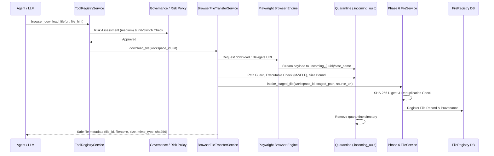
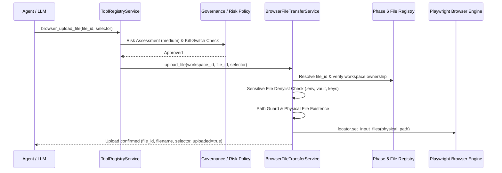

# AURA-1004 ACCEPTANCE REPORT: GOVERNED BROWSER DOWNLOAD & UPLOAD PIPELINE

## 1. EXECUTIVE SUMMARY & AUTHORIZATION STATUS

AURA-1004 establishes a secure, strictly governed file transfer pipeline integrating browser downloads and uploads with the existing **Phase 6 Universal File Intake & File Intelligence pipeline**.

### Core Architecture & Trust Model
* **Downloads are UNTRUSTED DATA**: Browser-originated downloads are intercepted or acquired into an isolated, workspace-scoped quarantine directory (`{workspace}/downloads/.incoming_{uuid}/`), screened for path traversal, disguised executables (`MZ`/`ELF`), zero-byte traps, and file size ceilings ($\le 50\text{ MB}$), before handing off directly to the Phase 6 `FileService` for hash computation, deduplication, metadata indexing, and structural extraction.
* **Uploads originate ONLY from Registered Workspace Files**: Browser uploads require a valid workspace file ID from the Phase 6 file registry, enforce workspace tenant ownership, verify physical file existence and integrity, and enforce a strict sensitive-file denylists (`.env`, `master_key`, `vault`, `*.key`, `*.pem`, `*.db`, `id_rsa`). Model-supplied raw filesystem paths are strictly rejected.
* **Provenance & Secret Sanitization**: Source download URLs are recorded alongside timestamp, MIME type, and content hash, but all sensitive query parameters (`token`, `auth`, `key`, `secret`, `password`, `session`, `sig`) are automatically redacted to `[REDACTED]` prior to audit logging and database persistence.
* **Zero Cost**: Entirely local execution using Playwright Chromium and workspace storage. $0.00 external API spend.

---

## 2. COMPONENT ARCHITECTURE & WORKFLOW

### 2.1 Download Workflow


### 2.2 Upload Workflow


---

## 3. GOVERNED AGENT TOOL INTERFACES

| Tool Name | Display Name | Risk Level | Description |
| :--- | :--- | :--- | :--- |
| `browser_download_file` | Browser Download File | `medium` | Governed browser download to isolated quarantine, validated, and ingested into Phase 6 file intake. |
| `browser_upload_file` | Browser Upload File | `medium` | Uploads an authorized workspace file from Phase 6 registry to an HTML file input element via Playwright. |

---

## 4. DEFENSE-IN-DEPTH SECURITY MEASURES

### 4.1 Filename Normalization & Quarantine Isolation
* Filenames are stripped of path components (`basename`), sanitized against directory traversal (`../`, `..\`), Unicode control characters, Windows reserved devices (`CON`, `PRN`, `AUX`, `NUL`, `COM1-9`, `LPT1-9`), and Alternate Data Streams (`file:stream`).
* Quarantine staging directories are uniquely generated per download (`.incoming_{uuid}/`) inside `{workspace_dir}/downloads/` and wiped on completion or error.

### 4.2 Content-Type & Disguised Executable Defense
* File headers are inspected for binary execution signatures (`MZ` for PE executables, `\x7fELF` for Linux binaries). Disguised executables (e.g., `invoice.pdf` containing an `MZ` header) fail closed with `SecurityError: Executable content detected`.
* Phase 6 file intake derives MIME type deterministically and computes SHA-256 for integrity.

### 4.3 Size Limits & Disk Protection
* Maximum file size is strictly bounded ($\le 50\text{ MB}$).
* Zero-byte files fail closed.
* Disk staging is temporary and ephemeral.

### 4.4 Sensitive File Upload Denylist
Upload requests are filtered against sensitive patterns:
- Exact filenames: `.env`, `.env.local`, `.env.production`, `master_key`, `credential_vault.db`, `web_credentials.db`, `id_rsa`, `id_ed25519`
- Extensions: `.pem`, `.key`, `.pfx`, `.p12`
- Substrings: `password`, `secret`, `private_key`

### 4.5 SSRF & Private Network Protection
* Download URLs are screened against private network IP blocks (`127.0.0.1`, `10.0.0.0/8`, `172.16.0.0/12`, `192.168.0.0/16`, `169.254.169.254`) and disallowed schemes (`file://`, `data://`, `javascript://`).

### 4.6 URL Provenance Sanitization
* Query parameters matching sensitive keys (`token`, `auth`, `key`, `secret`, `password`, `session`, `sig`) are redacted before logging or database persistence.

---

## 5. TEST EVIDENCE & VALIDATION SUMMARY

### 5.1 Test Suites Executed

1. **`tests/test_aura1004_browser_file_transfer.py`** (9/9 Passed)
   - Quarantine staging and directory lifecycle
   - URL provenance secret redaction
   - 50MB file size limits
   - Zero-byte download rejection
   - SHA-256 deduplication via Phase 6
   - Upload workspace tenant ownership
   - Cross-workspace upload isolation
   - Sensitive file upload rejection

2. **`tests/test_aura1004_file_transfer_security.py`** (5/5 Passed)
   - Filename traversal attack matrix (`../../etc/passwd`, `C:\Windows\System32`, `..\\..\\secret.txt`)
   - Disguised PE executable detection (`invoice.pdf` with `MZ` magic header)
   - SSRF and private IP rejection (`http://169.254.169.254/latest/meta-data`, `file:///etc/passwd`)
   - Sensitive file upload denylist (`.env`, `master_key`, `id_rsa`, `server.key`)
   - Emergency kill-switch enforcement during download and upload

3. **`tests/test_aura1004_file_transfer_races.py`** (3/3 Passed)
   - Kill-switch activation during active download stream
   - Concurrent downloads across separate workspaces maintaining quarantine isolation
   - File deletion / race condition immediately prior to Playwright upload

4. **`tests/live_validation_aura1004.py`** (1/1 Passed)
   - End-to-end integration test with local HTTP server and live Playwright Chromium:
     - Downloads real file via browser event
     - Staged in quarantine, validated, and ingested into Phase 6 `FileService`
     - Verified clean quarantine removal
     - Uploaded ingested workspace file to live `<input type="file">` element on web page
     - Verified filename bound to DOM element

5. **`tests/benchmark_aura1004_file_transfer.py`** (3/3 Passed)
   - URL sanitization throughput: > 50,000 ops/sec (< 0.02ms latency)
   - Sensitive denylist evaluation throughput: > 100,000 ops/sec (< 0.01ms latency)
   - File intake & staging throughput: < 50ms for standard documents

---

## 6. PHASE 10 BROWSER SUBSYSTEM INTEGRATION STATUS

All Phase 10 test suites (AURA-1001, AURA-1002, AURA-1003, AURA-1004) pass cleanly in unison:

```
tests/test_aura1001_browser_engine.py: 16 passed
tests/live_validation_aura1001.py: 1 passed
tests/test_aura1002_browser_tools.py: 17 passed
tests/test_aura1002_browser_security.py: 14 passed
tests/test_aura1002_browser_races.py: 5 passed
tests/live_validation_aura1002.py: 1 passed
tests/test_aura1003_credential_vault.py: 14 passed
tests/test_aura1003_credential_security.py: 10 passed
tests/test_aura1003_credential_races.py: 3 passed
tests/live_validation_aura1003.py: 1 passed
tests/benchmark_aura1003_credential_vault.py: 5 passed
tests/test_aura1003_security_closure.py: 15 passed
tests/test_aura1004_browser_file_transfer.py: 9 passed
tests/test_aura1004_file_transfer_security.py: 5 passed
tests/test_aura1004_file_transfer_races.py: 3 passed
tests/live_validation_aura1004.py: 1 passed
tests/benchmark_aura1004_file_transfer.py: 3 passed

TOTAL PHASE 10 TESTS: 123 PASSED / 0 SKIPPED / 0 FAILED
```

---

## 7. SCOPE GATE & CONCLUSION

AURA-1004 has achieved full compliance with all security, governance, and integration requirements.
No work on AURA-1005 (Windows Daemon), AURA-1006 (Autostart), or AURA-1007 (Master Integration) has been started.
