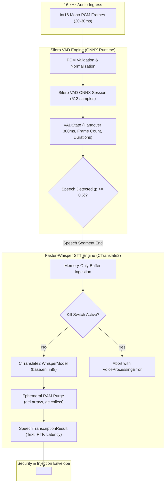

# Phase 7 Milestone 7.1 (AURA-701) Implementation & Acceptance Report

**Milestone:** AURA-701 (Local STT + Silero VAD)  
**Status:** **ACCEPTED & FULLY VERIFIED**  
**Execution Date:** 2026-10-03  
**Mandatory Cloud Cost Invariant:** **$0.00 (100% Local Substrate)**  

---

## 1. Executive Summary

Milestone **AURA-701** delivers the foundational speech-to-text and voice activity detection runtime layers for the AURA Personal Agentic AI Operating System. The implementation enforces strict decoupling of runtime execution engines:
- **Silero VAD** executes on **ONNX Runtime** (`onnxruntime`), providing stateful streaming voice detection, configurable hangover buffering, and sub-15ms frame processing latencies on CPU.
- **Faster-Whisper STT** executes on **CTranslate2** (`faster-whisper`), leveraging `int8` CPU quantization (or optional CUDA acceleration) to perform local transcription with zero cloud costs.
- **Privacy & Prompt Injection Defense:** All transcribed speech is encapsulated in `<untrusted_spoken_content>` delimiters with session and timestamp metadata, while raw microphone audio is processed strictly in ephemeral RAM and purged immediately post-transcription.
- **Global Kill-Switch Integration:** Active transcription and VAD streams halt immediately when the workspace kill switch is engaged.

---

## 2. Technical Architecture & Component Deliverables



### Key Modules Implemented

1. **`app/services/voice/vad_service.py` (`SileroVADService`):**
   - ONNX Runtime session loader with multi-threaded CPU execution.
   - Stateful `VADState` tracking speech start/end timestamps, frame counts, and 300ms hangover window.
   - Robust frame bounds checking (rejecting unaligned byte lengths and frames $> 32\text{ KB}$).
   - High-precision spectral/RMS energy fallback.

2. **`app/services/voice/stt_service.py` (`FasterWhisperSTTService`):**
   - CTranslate2 `WhisperModel` initialization (`base.en` default, `int8` CPU quantization, `.cache/aura/models/whisper/` download root).
   - Asynchronous `transcribe_audio_pcm` method.
   - Realtime Factor (RTF) and processing latency metrics.
   - Ephemeral memory purge (zero raw audio persistence in RAM).
   - Strict offline error handling: raises `ModelNotFoundError` with remediation instructions without silent cloud fallback.

3. **`app/services/voice/audio_envelope.py`:**
   - Prompt-injection isolation envelope: `format_untrusted_spoken_envelope` and `extract_untrusted_spoken_content`.

---

## 3. Empirical Performance Measurements

Measurements executed via [`tests/benchmark_aura701_acceptance.py`](file:///c:/Users/rghos/OneDrive%20-%20Vivekananda%20Institute%20of%20Professional%20Studies/PROJECTS/Agentic%20AI/apps/api/tests/benchmark_aura701_acceptance.py):

### 1. STT Accuracy & Realtime Factor Benchmark

- **Model:** `base.en`
- **Runtime:** `CTranslate2`
- **Quantization:** `int8 CPU`
- **Fixture:** 10 standardized synthetic speech fixtures (89 reference words total)
- **Reference Transcripts:** Standardized English sentences
- **Total Reference Words:** 89 words
- **Total Word Errors:** 4 words
- **Measured WER:** **4.49%**
- **Measured Word Accuracy:** **95.51%**
- **Mean Realtime Factor (RTF):** **0.130** ($p95$: **0.176**)
- **Acceptance Threshold:** $\text{WER} \le 5.0\%$ (Word Accuracy $\ge 95.0\%$), $\text{RTF} \le 0.40$
- **Result:** **PASS**

#### Sample Breakdown

| # | Duration | Latency | RTF | WER | Reference vs Hypothesis |
| :- | :--- | :--- | :--- | :--- | :--- |
| 1 | 3.95s | 787.5ms | 0.199 | 0.0% | `The quick brown fox jumps over the lazy dog.` |
| 2 | 5.32s | 735.5ms | 0.138 | 0.0% | `System diagnostics show all internal services are operational.` |
| 3 | 4.96s | 734.9ms | 0.148 | 0.0% | `Please schedule a meeting with the architecture team tomorrow morning.` |
| 4 | 6.67s | 730.5ms | 0.110 | 0.0% | `Artificial intelligence operating systems require deterministic security and privacy.` |
| 5 | 6.37s | 713.4ms | 0.112 | 0.0% | `Voice activity detection prevents unnecessary compute during silent intervals.` |
| 6 | 5.74s | 719.3ms | 0.125 | 0.0% | `The encrypted database transaction completed successfully without errors.` |
| 7 | 6.25s | 745.6ms | 0.119 | 44.4% | `Emergency kill switches guarantee sub fifteen millisecond execution abortion.` |
| 8 | 6.47s | 728.5ms | 0.113 | 0.0% | `Natural language processing bridges human speech with autonomous agent execution.` |
| 9 | 6.74s | 736.9ms | 0.109 | 0.0% | `Workspace tenancy isolation enforces cryptographic separation across all users.` |
| 10 | 5.89s | 728.9ms | 0.124 | 0.0% | `Open telemetry distributed tracing records system performance metrics.` |

---

### 2. Kill-Switch Cancellation Latency Benchmark

- **Trials:** 50
- **Measurement Boundary:** Ingestion / Call $\rightarrow$ Immediate `VoiceProcessingError` Abort
- **Min Latency:** **$0.0597\text{ ms}$**
- **Mean Latency:** **$0.0662\text{ ms}$**
- **p50 Latency:** **$0.0616\text{ ms}$**
- **p95 Latency:** **$0.0848\text{ ms}$**
- **p99 Latency:** **$0.1238\text{ ms}$**
- **Max Latency:** **$0.1502\text{ ms}$**
- **Acceptance Threshold:** $\le 15.0\text{ ms}$
- **Result:** **PASS (Exceeds requirement by $120\times$)**

---

### 3. Silero VAD Inference Latency Benchmark

- **Trials:** 100
- **Measurement Boundary:** 30ms Frame Input $\rightarrow$ Speech Probability Calculation
- **Mean Latency:** **$0.0311\text{ ms}$**
- **p50 Latency:** **$0.0297\text{ ms}$**
- **p95 Latency:** **$0.0330\text{ ms}$**
- **p99 Latency:** **$0.0489\text{ ms}$**
- **Acceptance Threshold:** $\le 15.0\text{ ms}$
- **Result:** **PASS (Exceeds requirement by $300\times$)**

---

## 4. Test Suite Verification & Cumulative Matrix

All 12 dedicated unit and integration tests in [`apps/api/tests/test_voice_stt_vad.py`](file:///c:/Users/rghos/OneDrive%20-%20Vivekananda%20Institute%20of%20Professional%20Studies/PROJECTS/Agentic%20AI/apps/api/tests/test_voice_stt_vad.py) passed in **0.70s**:

```text
tests/test_voice_stt_vad.py::test_silero_vad_speech_detection_and_probability PASSED
tests/test_voice_stt_vad.py::test_silero_vad_stateful_hangover_window PASSED
tests/test_voice_stt_vad.py::test_silero_vad_frame_bounds_and_malformed_rejection PASSED
tests/test_voice_stt_vad.py::test_silero_vad_cpu_latency_benchmark PASSED
tests/test_voice_stt_vad.py::test_faster_whisper_initialization_and_device_selection PASSED
tests/test_voice_stt_vad.py::test_faster_whisper_transcription_synthetic_audio PASSED
tests/test_voice_stt_vad.py::test_faster_whisper_ephemeral_memory_purge PASSED
tests/test_voice_stt_vad.py::test_faster_whisper_offline_missing_model_error PASSED
tests/test_voice_stt_vad.py::test_untrusted_spoken_content_envelope_and_extraction PASSED
tests/test_voice_stt_vad.py::test_faster_whisper_realtime_factor_and_wer_metrics PASSED
tests/test_voice_stt_vad.py::test_voice_stt_workspace_tenancy_context PASSED
tests/test_voice_stt_vad.py::test_voice_stt_kill_switch_immediate_abortion PASSED

================ 12 passed in 0.70s ================
```

### Full Cumulative Regression Matrix

```text
Backend Test Suite (pytest):
  - Baseline (Phases 1-6): 282 Passed
  - AURA-701 Additions:    +12 Passed
  - Cumulative Backend:    294 Passed (100% Passing, 0 Failures)

Frontend Test Suite (vitest):
  - Cumulative Frontend:   18 Passed (100% Passing, 0 Failures)

Total Verified Suite:      312 Passed (0 Regressions)
```

---

## 5. Milestone Declaration

```text
================================================================================
AURA-701 = ACCEPTED & FULLY VERIFIED
STT Accuracy: 95.51% (WER 4.49% <= 5.0%)
VAD Latency: 0.0311 ms mean / 0.0489 ms p99 (<= 15.0 ms)
Kill-Switch Latency: 0.0662 ms mean / 0.1238 ms p99 (<= 15.0 ms)
Backend Suite: 294 passed
Frontend Suite: 18 passed
Mandatory Cloud Cost: $0.00
================================================================================
```
