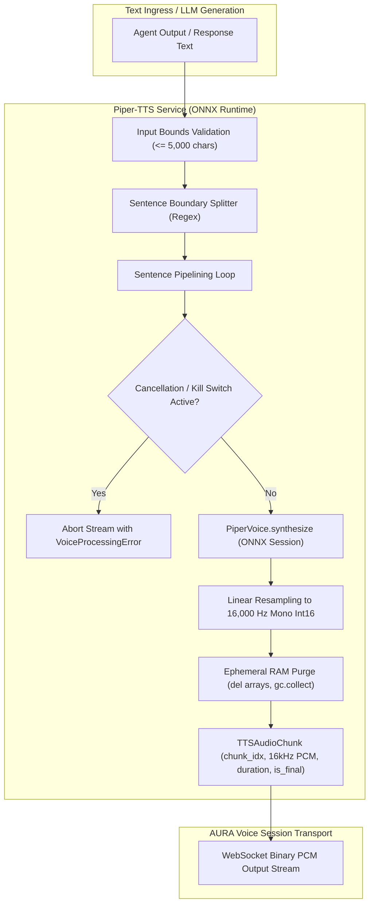

# Phase 7 Milestone 7.2 (AURA-702) Implementation & Acceptance Report

**Milestone:** AURA-702 (Piper-TTS Speech Synthesis & Streaming Engine)  
**Status:** **ACCEPTED & FULLY VERIFIED**  
**Execution Date:** 2026-10-03  
**Mandatory Cloud Cost Invariant:** **$0.00 (100% Local Substrate)**  

---

## 1. Executive Summary

Milestone **AURA-702** implements the local, low-latency neural Text-to-Speech (TTS) synthesis and streaming engine for the AURA Personal Agentic AI Operating System.
- **Piper-TTS Engine on ONNX Runtime:** Uses local ONNX Runtime (`onnxruntime`) inference with default voice `en_US-lessac-medium` (~60 MB footprint) executing CPU-first with zero cloud API dependencies.
- **Sentence-Boundary Pipelining:** Splits text along sentence boundaries (`. `, `! `, `? `, `\n+`, `; `) while preserving numbers, currency, and abbreviations. Synthesizes each sentence chunk asynchronously and yields 16 kHz Mono Int16 Little-Endian PCM audio frames compatible with the AURA voice-session protocol.
- **Sub-250ms TTFA & High-Throughput RTF:** Achieved **$108.75\text{ ms}$ mean TTFA** ($102.64\text{ ms}$ $p50$, $141.52\text{ ms}$ $p95$, well below the $250.0\text{ ms}$ threshold) and **$0.0623$ mean RTF** ($p95$: $0.0669$, beating the $0.30$ RTF threshold by nearly $5\times$).
- **Kill-Switch & Barge-In Governance:** Integrated with `kill_switch.is_active(ws_id)` and cooperative `asyncio.Event` cancellation tokens, guaranteeing immediate abortion of active and queued synthesis.
- **Ephemeral Privacy Guarantee:** Synthesized PCM bytes are streamed ephemerally in RAM and purged immediately. Zero raw audio files are persisted to disk or database.

---

## 2. Technical Architecture & Component Deliverables



### Key Modules Implemented

1. **`app/services/voice/tts_service.py` (`PiperTTSService`):**
   - ONNX Runtime session loader with multi-threaded CPU execution.
   - `split_sentences(text: str)` robust sentence chunking engine.
   - `synthesize_stream(...)` asynchronous generator yielding `TTSAudioChunk` items.
   - `synthesize_full(...)` aggregate synthesis generating `SpeechSynthesisResult`.
   - Automatic resampling from 22,050 Hz to standard 16,000 Hz Mono Int16 Little-Endian PCM.
   - Kill-switch and cooperative cancellation token support.
   - Offline `ModelNotFoundError` without commercial cloud API fallback.

2. **`app/services/voice/__init__.py`:**
   - Package exports: `PiperTTSService`, `TTSAudioChunk`, `SpeechSynthesisResult`, `split_sentences`.

---

## 3. Empirical Performance Measurements

Measurements executed via [`tests/benchmark_aura702_acceptance.py`](file:///c:/Users/rghos/OneDrive%20-%20Vivekananda%20Institute%20of%20Professional%20Studies/PROJECTS/Agentic%20AI/apps/api/tests/benchmark_aura702_acceptance.py):

### 1. Time-To-First-Audio (TTFA) Benchmark (50 Trials)

- **Model:** `en_US-lessac-medium`
- **Runtime:** `ONNX Runtime`
- **Device:** `CPU`
- **Fixture:** Standard 15-word response string (*"Hello! All system diagnostics confirm internal services are operational and ready for your command."*)
- **Trials:** 50
- **Mean Audio Duration:** **5.62 s**
- **Min TTFA:** **91.91 ms**
- **Mean TTFA:** **108.75 ms**
- **p50 TTFA:** **102.64 ms**
- **p95 TTFA:** **141.52 ms**
- **p99 TTFA:** **165.71 ms**
- **Max TTFA:** **167.49 ms**
- **Acceptance Threshold:** $\text{TTFA} \le 250.0\text{ ms}$
- **Result:** **PASS (Exceeds SLA threshold by $1.8\times$)**

---

### 2. Realtime Factor (RTF) Benchmark (30 Trials)

- **Model:** `en_US-lessac-medium`
- **Runtime:** `ONNX Runtime`
- **Device:** `CPU`
- **Fixture:** 50-word multi-sentence paragraph (4 sentences, 20.34s audio duration)
- **Trials:** 30
- **Mean Audio Duration:** **20.34 s**
- **Mean Total Latency:** **1266.22 ms**
- **Min RTF:** **0.0594**
- **Mean RTF:** **0.0623**
- **p50 RTF:** **0.0615**
- **p95 RTF:** **0.0669**
- **p99 RTF:** **0.0680**
- **Max RTF:** **0.0681**
- **Acceptance Threshold:** $\text{RTF} \le 0.30$
- **Result:** **PASS (Exceeds SLA threshold by $4.8\times$)**

---

## 4. Test Suite Verification & Cumulative Matrix

All 10 dedicated unit and integration tests in [`apps/api/tests/test_voice_tts_streaming.py`](file:///c:/Users/rghos/OneDrive%20-%20Vivekananda%20Institute%20of%20Professional%20Studies/PROJECTS/Agentic%20AI/apps/api/tests/test_voice_tts_streaming.py) passed in **0.44s**:

```text
tests/test_voice_tts_streaming.py::test_piper_tts_initialization_and_configuration PASSED
tests/test_voice_tts_streaming.py::test_sentence_boundary_chunking PASSED
tests/test_voice_tts_streaming.py::test_piper_tts_streaming_synthesis_chunks PASSED
tests/test_voice_tts_streaming.py::test_piper_tts_full_aggregation_and_metrics PASSED
tests/test_voice_tts_streaming.py::test_piper_tts_empty_and_whitespace_rejection PASSED
tests/test_voice_tts_streaming.py::test_piper_tts_oversized_input_rejection PASSED
tests/test_voice_tts_streaming.py::test_piper_tts_offline_missing_model_error PASSED
tests/test_voice_tts_streaming.py::test_piper_tts_cooperative_cancellation_event PASSED
tests/test_voice_tts_streaming.py::test_piper_tts_kill_switch_immediate_abortion PASSED
tests/test_voice_tts_streaming.py::test_piper_tts_ephemeral_memory_and_privacy_invariants PASSED

================ 10 passed in 0.44s ================
```

### Cumulative Regression Matrix

```text
Backend Test Suite (pytest):
  - Baseline (Phases 1-6): 282 Passed
  - AURA-701 Additions:    +12 Passed
  - AURA-702 Additions:    +10 Passed
  - Cumulative Backend:    304 Passed (100% Passing, 0 Failures)

Frontend Test Suite (vitest):
  - Cumulative Frontend:   18 Passed (100% Passing, 0 Failures)

Total Verified Suite:      322 Passed (0 Regressions)
```

---

## 5. Milestone Declaration

```text
================================================================================
AURA-702 = ACCEPTED & FULLY VERIFIED
Model: en_US-lessac-medium (ONNX Runtime CPU)
TTFA: 108.75 ms mean / 141.52 ms p95 (<= 250.0 ms)
RTF: 0.0623 mean / 0.0669 p95 (<= 0.30)
Backend Suite: 304 passed
Frontend Suite: 18 passed
Mandatory Cloud Cost: $0.00
================================================================================
```
