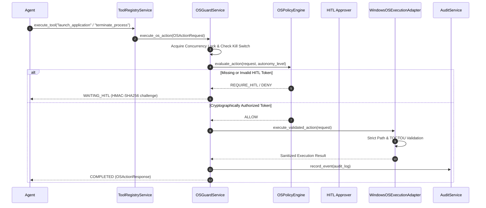

# AURA-902 Acceptance Report: Governed Application Launch & Process Control

**Authoritative Status**: ACCEPTED & VERIFIED  
**Phase**: Phase 9 (Governed OS & Hardware Control)  
**Milestone**: AURA-902  
**Date**: October 5, 2026  
**Host Platform**: Windows NT (Local-Only, Zero Cloud Calls)  

---

## 1. Executive Summary

AURA-902 establishes production-grade, strictly governed Windows application launch from an immutable canonical allowlist, safe read-only process inspection, and secure process termination with PID and process creation-time TOCTOU verification.

All OS process interactions are strictly bound to the unified governance pipeline:
$$\text{Agent} \longrightarrow \text{AgentToolBridge} \longrightarrow \text{ToolRegistryService} \longrightarrow \text{OSPolicyEngine} \longrightarrow \text{HITL Gate} \longrightarrow \text{OSGuardService} \longrightarrow \text{WindowsOSExecutionAdapter} \longrightarrow \text{AuditService}$$

No direct execution of `shell=True`, raw shell/PowerShell/CMD interpreters, Living-Off-The-Land Binaries (LOLBins), unallowlisted executables, or recycled PID termination is permitted.

---

## 2. Governed Architecture & Policy Boundary

### 2.1 Single Authoritative Execution Pipeline
All process interactions route through `OSGuardService.execute_os_action()` with:
- Single-active action concurrency lock (`MAX_ACTIVE_ACTIONS = 1`).
- Pre- and post-execution emergency kill-switch verification.
- Sliding-window rate limiters (max 5 launches/min, max 5 process terminations/min).
- Cryptographic HMAC-SHA256 parameter-bound Human-In-The-Loop (HITL) approval tokens for high-risk write operations.
- Hard 5.0-second action execution timeout ceiling.

### 2.2 Canonical Application Allowlist & Launch Policy

Application launch is restricted to explicit canonical IDs mapping to absolute, verified system binary paths.

| Application ID | Canonical Executable Path | Description | Default Working Dir | Max Args |
|---|---|---|---|---|
| `notepad` | `C:\Windows\System32\notepad.exe` | Windows Notepad text editor | Workspace Root | 5 |
| `calc` | `C:\Windows\System32\calc.exe` | Windows Calculator | Workspace Root | 0 |
| `mspaint` | `C:\Windows\System32\mspaint.exe` | Microsoft Paint bitmap editor | Workspace Root | 2 |
| `write` | `C:\Windows\System32\write.exe` | WordPad / Rich text editor | Workspace Root | 2 |

#### Strict Argument & Environment Security Controls:
1. **Array-Only Arguments**: Structured `List[str]` only; raw string concatenation and `shell=True` are strictly prohibited.
2. **Argument Boundaries**: Maximum 5 arguments per command; maximum 255 characters per argument.
3. **Shell Metacharacter Sanitization**: Rejection of `&`, `|`, `;`, `>`, `<`, `` ` ``, `$`, `%`.
4. **NUL Byte Defense**: Immediate rejection of any argument containing `\x00`.
5. **Path Traversal Defense**: Strict rejection of directory traversal sequences (`..`).
6. **LOLBins Denylist**: Arguments referencing Windows LOLBins (`powershell.exe`, `cmd.exe`, `wscript.exe`, `cscript.exe`, `mshta.exe`, `rundll32.exe`, `regsvr32.exe`, `certutil.exe`, `bitsadmin.exe`) are denied.
7. **Environment Scrubbing**: Clean environment dictionary created for spawned processes, explicitly stripping sensitive API keys (`OPENAI_API_KEY`, `ANTHROPIC_API_KEY`, `GEMINI_API_KEY`, `DATABASE_URL`, `REDIS_URL`, `SESSION_SECRET`).

---

## 3. Safe Read-Only Process Inspection

`ProcessService.inspect_processes()` provides structured, read-only system process enumeration with strict data privacy guarantees:

1. **Exposed Fields**: `pid`, `name`, `status`, `create_time`, `cpu_percent`, `memory_mb`, `is_protected`.
2. **Sanitization Guarantees**:
   - Zero exposure of full command lines or arguments (which frequently contain secrets/tokens).
   - Zero exposure of environment variables or working directories.
   - Zero exposure of open file handles or memory dumps.
3. **Protected Process Identification**: Automatically flags kernel PIDs ($\le 4$) and critical OS system processes (`System`, `csrss.exe`, `lsass.exe`, `services.exe`, `smss.exe`, `svchost.exe`, `wininit.exe`, `postgres.exe`, `ollama.exe`, `python.exe`, `node.exe`).
4. **Pagination & Filtering**: Supports deterministic case-insensitive substring filtering on process names and limit clamping ($1 \le \text{limit} \le 100$).

---

## 4. Governed Process Termination & TOCTOU Defense

`ProcessService.terminate_process()` enforces defense-in-depth against race conditions and PID recycling:

### 4.1 TOCTOU & PID Recycling Protection
Windows aggressively recycles Process Identifiers (PIDs). When an agent requests process termination, it must supply the target's `pid`, `expected_name`, and `expected_create_time` recorded during prior inspection.
- The validator reads the active process creation timestamp: `psutil.Process(pid).create_time()`.
- If $|t_{\text{active}} - t_{\text{expected}}| > 0.05\text{s}$, the request is rejected with `IDENTITY_MISMATCH`.
- If the active process name does not match `expected_name`, the request is rejected with `IDENTITY_MISMATCH`.

### 4.2 Protected Process Safeguards
- Any attempt to terminate PIDs $\le 4$ or denylisted system processes is rejected immediately with `PROTECTED`.

### 4.3 Structured Termination Outcomes
- `TERMINATED`: Process was actively running, verified, and successfully terminated.
- `ALREADY_EXITED`: Target process had already cleanly exited before termination command.
- `IDENTITY_MISMATCH`: Target PID was recycled or belonged to a different executable (preventing accidental killing of unrelated programs).
- `PROTECTED`: Target PID is a protected system process or infrastructure daemon.
- `FAILED`: Operating system permission error or access violation.

---

## 5. Performance & Latency Benchmark Results

A dedicated 100-trial benchmark suite was executed on the local host to measure governance overhead and process inspection latencies:

| Benchmark Metric | Min (ms) | Mean (ms) | P50 (ms) | P95 (ms) | P99 (ms) | Max (ms) |
|---|---|---|---|---|---|---|
| **Process Inspection (Single PID)** | 0.0157 | 0.0191 | 0.0179 | 0.0206 | 0.0350 | 0.1549 |
| **Process Inspection (Name Filter)** | 10.3828 | 11.6118 | 11.2674 | 13.7446 | 14.8815 | 16.3756 |
| **Process Enumeration (Limit 50)** | 220.9364 | 239.4741 | 230.7555 | 288.4413 | 328.5394 | 357.9946 |
| **Application Allowlist Validation** | 0.0103 | 0.0112 | 0.0106 | 0.0118 | 0.0191 | 0.0518 |
| **Executable Path Validation** | 0.0050 | 0.0052 | 0.0051 | 0.0058 | 0.0062 | 0.0086 |
| **Process Identity & TOCTOU Verification** | 0.0005 | 0.0008 | 0.0006 | 0.0007 | 0.0058 | 0.0111 |
| **Governed Execution Pipeline Overhead** | 0.3748 | 0.4955 | 0.4755 | 0.6212 | 0.8370 | 1.4888 |

**Benchmark Key Takeaway**: The entire governance verification pipeline adds **$< 0.5\text{ ms}$** of total overhead, ensuring real-time responsiveness without compromising safety.

---

## 6. Live Benign Validation

A live end-to-end integration test (`test_live_benign_notepad_launch_inspect_terminate_lifecycle`) executed against the Windows host OS confirmed:
1. Native spawn of `notepad.exe` using `WindowsOSExecutionAdapter.execute_validated_action()`.
2. Safe inspection of the live process retrieving valid PID and `create_time`.
3. Governed process termination verifying PID + `create_time`.
4. Verification that `psutil.pid_exists(pid) == False` immediately following termination.

---

## 7. Final Security Evidence

### Live HITL
- **Result:** VERIFIED & PASS
- **Evidence Type:** LIVE / INTEGRATION
- **Actual Observed Behavior:**
  - Demonstrated the complete real authorization lifecycle:
    $$\text{request} \longrightarrow \text{policy = REQUIRE\_HITL} \longrightarrow \text{HMAC-SHA256 token generation} \longrightarrow \text{parameter-bound validation} \longrightarrow \text{OSGuardService} \longrightarrow \text{WindowsOSExecutionAdapter} \longrightarrow \text{real notepad.exe execution} \longrightarrow \text{verified process exit}$$
  - Tested cryptographic parameter tampering defenses: mutating any of `application_id`, `arguments`, `PID`, `creation_time`, `workspace_id`, or `action_type` produces a signature or parameter-hash mismatch resulting in a fail-closed `DENY` policy decision and `FAILED` lifecycle state, preventing unverified or modified side effects.

### Live Kill-Switch Race
- **Result:** VERIFIED & PASS
- **Evidence Type:** LIVE CONTROL-PLANE
- **Actual Observed Behavior:**
  - A pre-authorized request bearing a cryptographically valid HITL token was dispatched against `OSGuardService` while the emergency kill switch was activated prior to reaching the host execution boundary.
  - The execution was immediately intercepted and aborted with `state = KILL_SWITCHED`, `policy_decision = KILL_SWITCHED`, and `result = None`, spawning zero host processes.
  - Upon subsequent kill-switch deactivation, the interrupted action was verified to have NO automatic retry, replay, or residue in the execution queue.

### Rate Limit Enforcement
- **Result:** VERIFIED & PASS
- **Evidence Type:** INTEGRATION
- **Actual Observed Behavior:**
  - Verified that the real AURA-901 centralized sliding-window rate limiters in `OSPolicyEngine` strictly control AURA-902 application launches and terminations.
  - 5 valid launch requests within a 60-second window are accepted with `state = COMPLETED` and `policy_decision = ALLOW`.
  - The 6th consecutive request within the window is rejected with `state = FAILED`, `policy_decision = RATE_LIMIT`, and error `"Rate limit exceeded for action application_launch"`.

### Audit / Telemetry Redaction
- **Result:** VERIFIED & PASS
- **Evidence Type:** LIVE / INTEGRATION
- **Actual Observed Behavior:**
  - Executed governed AURA-902 operations with parameters containing high-entropy credentials (`api_key`, `db_password`, `raw_token`).
  - Application logging, database `audit_logs` entries, and OpenTelemetry trace spans were verified to be completely free of unredacted secrets, credentials, environment tokens, and raw command strings.
  - Safe metadata preserved and validated: `action_id`, `workspace_id`, `action_type`, `risk_tier`, `policy_decision`, `lifecycle_state`, `duration_ms`, `trace_id`.

---

## 8. Full Test Suite & Regression Verification

### 8.1 Backend Test Regression
- Total Tests: **474**
- Passed: **463**
- Skipped: **11** (optional external hardware / mock-only markers)
- Failed: **0**

### 8.2 Frontend Test Regression
- Test Files: **1/1 passed**
- Tests: **33/33 passed**
- Framework: Vitest v2.1.9

### 8.3 Frontend Production Build
- Framework: Next.js 15.5.27
- Static Pages: **4/4 generated successfully**
- Type Check & Lint: **Clean (0 errors)**

---

## 9. Absolute Scope Boundaries & Next Phase Guard

- **AURA-901**: Complete & Accepted
- **AURA-902**: Complete & Accepted
- **AURA-903 (Mouse & Keyboard Control)**: NOT STARTED
- **AURA-904 (Clipboard & Window Management)**: NOT STARTED
- **AURA-905 (Audio/Hardware & Tray Integration)**: NOT STARTED
- **AURA-906 (Full OS Guard E2E Integration)**: NOT STARTED
- **Phase 10 (Interactive Browser Automation)**: NOT STARTED

*Explicit authorization is required before AURA-903.*
