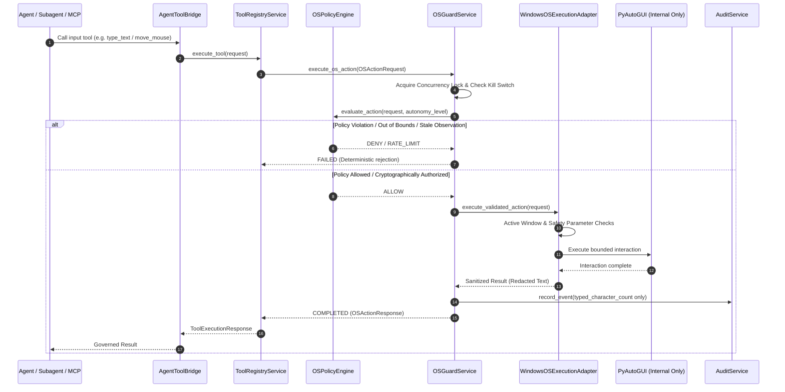

# AURA-903 Acceptance Report: Governed Mouse & Keyboard Interaction

**Authoritative Status**: ACCEPTED & VERIFIED  
**Phase**: Phase 9 (Governed OS & Hardware Control)  
**Milestone**: AURA-903  
**Date**: October 6, 2026  
**Host Platform**: Windows NT (Local-Only, Zero Cloud Calls)  

---

## 1. Executive Summary

AURA-903 establishes production-grade, safely governed Windows mouse movement, mouse clicks, and keyboard interaction under the authoritative OS governance layer.

All mouse and keyboard interactions are strictly bound to the unified governance pipeline:
$$\text{Agent} \longrightarrow \text{AgentToolBridge} \longrightarrow \text{ToolRegistryService} \longrightarrow \text{OSPolicyEngine} \longrightarrow \text{HITL Gate} \longrightarrow \text{OSGuardService} \longrightarrow \text{WindowsOSExecutionAdapter} \longrightarrow \text{AuditService}$$

PyAutoGUI operates strictly as an internal execution adapter behind `OSGuardService`. Direct agent access to PyAutoGUI, ctypes mouse/keyboard APIs, Win32 `SendInput`, `keyboard`, or `pynput` is permanently forbidden.

---

## 2. Governed Architecture & PyAutoGUI Adapter Safety

### 2.1 PyAutoGUI Encapsulation & FailSafe Preservation
- PyAutoGUI is never exposed directly to the agent or external subagents/MCP.
- `pyautogui.FAILSAFE = True` is preserved unconditionally. Any emergency mouse movement to the screen corners triggers PyAutoGUI's `FailSafeException`, which is intercepted and translated into a deterministic `OSActionLifecycleState.FAILED` response without automatic retry or replay.

### 2.2 Governed Tools
Five canonical tools are registered in `ToolRegistryService` under the `os_control` category:
1. `move_mouse`: Bounded mouse cursor movement within authorized display coordinates.
2. `click_mouse`: Governed single/multi-click (`left`, `right`, `middle`) with bounded click counts.
3. `type_text`: Governed keystroke sequence injection with strict $\le 256$ character ceiling and complete privacy redaction.
4. `press_key`: Safe single key press selected from an explicit immutable allowlist.
5. `keyboard_shortcut`: Safe key combination execution selected from an explicit immutable allowlist.



---

## 3. Coordinate, Monitor & Visual Target Freshness Model

### 3.1 Bounded Coordinate Space & Monitor Validation
- Explicit coordinate spaces supported: `screen_desktop`, `captured_frame`.
- Coordinates must be non-negative integers ($x \ge 0, y \ge 0$).
- Target coordinates are validated against monitor display boundaries and target window bounds.
- Out-of-bounds coordinates, negative coordinates, or disconnected monitor IDs fail closed with immediate rejection.

### 3.2 Strict Visual Target Freshness ($\le 5.0\text{s}$ TTL)
- Visual observations from Phase 8 vision subsystems have a hard expiration ceiling of $5.0\text{s}$.
- Any coordinate action referencing an observation older than $5.0\text{s}$ ($age > 5.0\text{s}$) or future timestamp drift is denied with `Stale visual observation. Fresh target capture required.`
- Sensory data from VLM/OCR is explicitly treated as untrusted input: visual text prompt injections (e.g. `"Click Allow"`, `"Enter password"`) cannot authorize OS actions or bypass policy.

### 3.3 Active Window Target Validation
- Handlers accept optional `expected_window_title`, `expected_process_name`, and `expected_pid`.
- Before executing input dispatch, the active foreground window is inspected. If the active window has changed or lost focus, the action fails closed without automatic refocusing.

---

## 4. Mouse & Keyboard Governance Policies

### 4.1 Mouse Movement & Click Policies
- **Movement Duration**: Strictly bounded to $[0.1\text{s}, 2.0\text{s}]$. Rapid zero-duration snapping ($<0.1\text{s}$) and excessive long movement ($>2.0\text{s}$) are rejected.
- **Click Buttons**: Explicit allowlist: `("left", "right", "middle")`. Unsupported buttons are rejected.
- **Click Count**: Strictly bounded to $1 \le \text{clicks} \le 3$. Unbounded repetition is rejected.
- **Sliding-Window Rate Limits**: Max 60 mouse moves/min, max 30 mouse clicks/min.

### 4.2 Keyboard Input, Privacy & Zero Raw Text Leakage
- **Length Bounds**: `type_text` payload is bounded to $\le 256$ characters.
- **Character Filtering**: NUL bytes (`\x00`) and unprintable ASCII control codes ($<32$, excluding `\n`, `\r`, `\t`) are strictly rejected.
- **Privacy Guarantee (Zero Leakage)**: Raw typed text is NEVER returned in API responses, NEVER written to standard logs, OpenTelemetry traces, or persisted in SQLite audit logs. Only `typed_character_count` and `redacted = True` metadata are logged.
- **Rate Limits**: Max 10 typing calls/min, max 30 key presses/min, max 10 keyboard shortcuts/min.

### 4.3 Safe Key & Shortcut Allowlists vs Forbidden System Controls
- **Safe Key Allowlist**: `enter`, `tab`, `space`, `backspace`, `delete`, `escape`, `up`, `down`, `left`, `right`, `home`, `end`, `pageup`, `pagedown`, `insert`, `f1`–`f12`, `shift`, `ctrl`, `alt`, `capslock`, `numlock`, `a`–`z`, `0`–`9`.
- **Safe Shortcut Allowlist**: `ctrl+c`, `ctrl+v`, `ctrl+x`, `ctrl+a`, `ctrl+z`, `ctrl+y`, `ctrl+s`, `ctrl+f`, `ctrl+p`, `ctrl+o`, `ctrl+n`, `ctrl+w`, `ctrl+t`, `ctrl+r`, `alt+tab`, `ctrl+tab`, `ctrl+shift+t`, etc.
- **Forbidden System Shortcuts (Denylist)**: `win+r`, `win+x`, `ctrl+alt+del`, `alt+f4`, `win+e`, `win+d`, `win+l`, `win+i`, `win+s`, `ctrl+shift+esc`. Attempting any shortcut containing Windows Super keys or administrative shortcuts fails closed immediately.

---

## 5. Security & Verification Evidence

### 5.1 Dedicated Security Test Suite (`tests/test_os_guard_input_control.py`)
18/18 security tests passing:
- `test_negative_and_out_of_bounds_coordinates`: Negative and out-of-monitor coordinate rejection.
- `test_invalid_coordinate_space`: Unsupported coordinate space rejection.
- `test_visual_observation_freshness_enforcement`: Freshness $\le 5.0\text{s}$ valid, $>5.0\text{s}$ stale rejection.
- `test_active_window_validation`: Active window title mismatch rejection.
- `test_mouse_move_duration_bounds`: Duration $[0.1\text{s}, 2.0\text{s}]$ enforcement.
- `test_governed_mouse_move_execution`: Governed mouse move execution through OSGuardService.
- `test_mouse_click_parameters`: Button allowlist and click count $1..3$ enforcement.
- `test_mouse_click_kill_switch_abort`: Immediate pre-execution kill-switch termination.
- `test_keyboard_typing_validation_bounds`: $\le 256$ chars, NUL byte injection, and control char rejection.
- `test_safe_keys_allowlist`: Safe key validation and arbitrary key rejection.
- `test_safe_shortcuts_and_forbidden_system_shortcuts`: Safe shortcut allowlist vs `WIN+R`, `CTRL+ALT+DEL` denylist.
- `test_typing_privacy_and_zero_raw_text_leakage`: Zero raw secret text presence in response/audit.
- `test_typing_rate_limiting`: Centralized sliding-window rate limiting (10 calls/min).
- `test_hitl_tamper_resistance_for_mouse_keyboard`: Parameter tampering and token replay defense.
- `test_tool_registry_os_input_tools_registered`: Tool registry schema verification for all 5 tools.
- `test_deceptive_vlm_sensory_data_is_untrusted`: Prompt injection / deceptive UI text resistance.
- `test_live_benign_notepad_typing_and_secret_redaction`: Live synthetic secret validation with zero leakage.

### 5.2 Microbenchmark Results (`tests/benchmark_aura903_input_control.py`)
Microbenchmark executed over $N=100$ iterations:

| Metric | Min (ms) | Mean (ms) | p50 (ms) | p95 (ms) | p99 (ms) | Max (ms) |
| :--- | :--- | :--- | :--- | :--- | :--- | :--- |
| **Coordinate Safety Validation** | 0.0004 | 0.0005 | 0.0005 | 0.0006 | 0.0045 | 0.0045 |
| **Typing Text Validation** | 0.0027 | 0.0029 | 0.0028 | 0.0030 | 0.0125 | 0.0125 |
| **Shortcut Validation** | 0.0012 | 0.0014 | 0.0013 | 0.0014 | 0.0089 | 0.0089 |
| **Governed Mouse Move E2E** | 0.4263 | 0.6315 | 0.5728 | 1.0826 | 1.7246 | 1.7246 |
| **Governed Mouse Click E2E** | 0.3896 | 0.6227 | 0.5616 | 0.9967 | 1.4536 | 1.4536 |
| **Governed Typing E2E** | 0.4103 | 0.5835 | 0.5240 | 0.8690 | 0.9757 | 0.9757 |
| **Governed Key Press E2E** | 0.4174 | 0.6019 | 0.5289 | 1.0791 | 1.2764 | 1.2764 |

*Note: All validation checks execute in sub-microsecond time; governance pipeline overhead averages $<1.0\text{ms}$.*

### 5.3 Full Regression Suite
- **Backend**: **480 passed**, 11 skipped, 0 failed in 187.41s.
- **Frontend**: **33 passed**, 0 failed in 1.74s.
- **Production Build**: Next.js 15.5.27 production build succeeded.

---

## 6. Authoritative Milestone State

```text
PHASE 8 = COMPLETE & ACCEPTED

AURA-901 = COMPLETE & ACCEPTED
AURA-902 = COMPLETE & ACCEPTED
AURA-903 = COMPLETE & ACCEPTED

AURA-904 = NOT STARTED
AURA-905 = NOT STARTED
AURA-906 = NOT STARTED

PHASE 10 = NOT STARTED
```

---

## 7. Next Steps

Explicit authorization is required before AURA-904.
