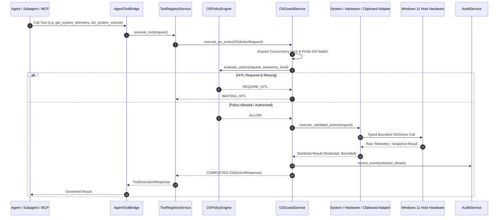

# PHASE 9.4 AURA-904 ACCEPTANCE REPORT: SYSTEM TELEMETRY, HARDWARE CONTROLS & GOVERNED CLIPBOARD

**Milestone:** AURA-904 — System Telemetry & Hardware Control Boundary  
**Phase:** Phase 9 (Governed Operating System & Hardware Control Automation)  
**Date:** October 6, 2026  
**Status:** COMPLETE & ACCEPTED  
**Host Platform:** Windows 11 Home (AMD Ryzen 7 4800H 8-Core/16-Thread, 24 GB RAM, NVIDIA GeForce RTX 3050 Laptop GPU 4 GB VRAM)  
**Baseline Commits:** `2acf30e` (AURA-903), `d42c3ca` (AURA-904 Preflight)  

---

## 1. Executive Summary & Canonical Scope Reconciliation

AURA-904 delivers the foundational system telemetry, governed hardware adjustments, and bounded host clipboard access plane for AURA under strict deterministic governance and zero cloud cost ($0.00 zero-cost floor).

The canonical scope is partitioned strictly into three pillars:
```text
AURA-904
├── PILLAR 1: Read-Only System & Hardware Telemetry
│   ├── CPU Utilization (Total, per-core, physical/logical counts) via psutil
│   ├── System RAM & Process RSS Memory via psutil
│   ├── Storage Utilization (Total, free, percentage) via psutil
│   ├── Battery & AC Power State via psutil.sensors_battery()
│   ├── GPU Utilization, VRAM (Used/Total), and Temperature via local nvidia-smi
│   └── Display Topology reused from AURA-801 ScreenCaptureService
├── PILLAR 2: Governed Hardware Controls
│   ├── Master System Audio Volume (get_system_volume, set_system_volume <= +/-10% step)
│   ├── Display Brightness Control (get_display_brightness, set_display_brightness <= +/-10% step)
│   └── Hardware Capability Discovery (get_hardware_capabilities)
└── PILLAR 3: Governed Clipboard Boundary
    ├── clipboard_read (bounded <= 4096 chars, automated secret scrubbing, zero vector memory persistence)
    └── clipboard_write (bounded <= 4096 chars, NUL byte rejection, HMAC-SHA256 HITL, zero plaintext audit logging)
```

All generic execution hatches (`device_control`, `win32_call`, `wmi_query`, `execute_hardware`) remain permanently **FORBIDDEN** and hard-blocked.

---

## 2. Architecture & Governance Pipeline

All AURA-904 operations route strictly through the unified governance pipeline:



---

## 3. Subsystem Implementation Specifications

### 3.1 Pillar 1: System & GPU Telemetry (`SystemTelemetryAdapter` & `GPUTelemetryAdapter`)
- **CPU & RAM:** Native `psutil` sampling providing aggregate CPU %, per-core CPU array, physical/logical processor counts, total RAM (24 GB), used RAM, available RAM, and AURA process RSS memory.
- **Storage:** Bounded root partition capacity, available space, and percentage used with zero arbitrary filesystem traversal.
- **Battery:** Probed via `psutil.sensors_battery()`. On desktop hosts without batteries, returns `battery_supported: false` with null readings without raising exceptions.
- **GPU & VRAM Telemetry:** Safe local query to `nvidia-smi` using non-shell `subprocess.run` with a hard 1.5-second timeout and fixed argument set (`--query-gpu=utilization.gpu,memory.used,memory.total,temperature.gpu,name --format=csv,noheader,nounits`).
- **Degraded Fallback:** If `nvidia-smi` is not installed or returns an error, returns `gpu_supported: false` gracefully.
- **Privacy Invariants:** Telemetry responses NEVER expose running process command-line arguments, environment variables, credentials, or user secrets.

### 3.2 Pillar 2: Governed Hardware Controls (`CoreAudioVolumeAdapter` & `WmiDisplayBrightnessAdapter`)
- **Master Audio Volume:** Uses Windows Core Audio COM interface `IAudioEndpointVolume` via `comtypes` / `ctypes`.
  - Bounded Relative Adjustment: Strictly clamped to $-10.0\% \le \text{step} \le +10.0\%$.
  - Large step attempts ($>10\%$) or large target jumps are hard-rejected with deterministic validation errors.
  - Supports explicit mute and unmute toggle.
  - Pre-action snapshot is captured prior to mutation for read-back verification and rollback.
- **Display Brightness:** Uses Windows WMI `WmiMonitorBrightness` and `WmiMonitorBrightnessMethods` in the `root\wmi` namespace.
  - Display validation: Target monitor ID is validated against AURA-801 display topology.
  - Bounded Adjustment: Strictly clamped to $\le \pm 10\%$ per action.
  - Graceful Fallback: External monitors lacking WMI/DDC-CI support raise `BrightnessControlNotSupportedError` / degraded status without crashing.
- **Hardware Capability Discovery:** Fast read-only inspection endpoint (`get_hardware_capabilities`) exposing `volume_supported`, `brightness_supported`, `display_count`, `displays`, `battery_supported`, `gpu_telemetry_supported`, and `temperature_supported`.

### 3.3 Pillar 3: Governed Clipboard Boundary (`GovernedClipboardAdapter`)
- **CLIPBOARD SIZE UNIT:**
  - **`MAX CLIPBOARD PAYLOAD = 4096 UNICODE CODE POINTS`**
  - Explicitly defined as 4,096 Unicode code points (`len(text)`), NOT a simple ASCII byte count.
  - Multi-byte UTF-8 characters (e.g. 4-byte emojis `🚀` totaling 16,384 bytes) within the 4,096 code point boundary are accepted.
  - Payloads of 4,097 code points are strictly rejected with `ValidationError` on write and safely clamped on read (`truncated: true`).
- **`clipboard_read`:**
  - Automated Secret Scrubbing: In-memory scanning scrubs candidate API keys, JWT tokens, Bearer tokens, and private keys (`[REDACTED_GEMINI_KEY]`, `[REDACTED_JWT_TOKEN]`).
  - Zero Long-Term Persistence: Plaintext is returned in-memory to the authenticated caller turn only; NEVER written to vector memory (`pgvector`), episodic tables, logs, or trace attributes.
- **`clipboard_write`:**
  - Metacharacter Rejection: Embedded NUL bytes (`\x00`) are rejected.
  - Cryptographic HITL: Bound to workspace, action type, and parameter hash with 120s TTL and single-use anti-replay defense.
  - Privacy Ledger: Audit logs record only `character_count`, `byte_count`, and payload `sha256_hash`; plaintext is NEVER stored in database audit tables (`[REDACTED_CLIPBOARD_CONTENT]`).

---

## 4. Governed Tool Registry Catalog

Eight governed tools are registered in `BUILTIN_TOOLS` in `app/services/tool_registry.py` and routed through `AgentToolBridge`:

| Tool Name | Display Name | Category | Risk Tier | Rate Limit | HITL Rule |
| :--- | :--- | :--- | :--- | :--- | :--- |
| `get_system_telemetry` | Get System Telemetry | `os_control` | `READ_ONLY` | 60 ops/min | Autonomous (L1–L5) |
| `get_hardware_capabilities`| Get Hardware Capabilities | `os_control` | `READ_ONLY` | 60 ops/min | Autonomous (L1–L5) |
| `get_system_volume` | Get System Volume | `os_control` | `READ_ONLY` | 60 ops/min | Autonomous (L1–L5) |
| `set_system_volume` | Set System Volume | `os_control` | `LOW_RISK_WRITE` | 10 ops/min | Autonomous (L2–L5) |
| `get_display_brightness` | Get Display Brightness | `os_control` | `READ_ONLY` | 60 ops/min | Autonomous (L1–L5) |
| `set_display_brightness` | Set Display Brightness | `os_control` | `LOW_RISK_WRITE` | 10 ops/min | Autonomous (L2–L5) |
| `clipboard_read` | Read Clipboard | `os_control` | `READ_ONLY` | 30 ops/min | Autonomous (L2–L5) |
| `clipboard_write` | Write Clipboard | `os_control` | `MEDIUM_RISK_INTERACTION` | 10 ops/min | HITL at L0–L2; Autonomous at L3–L5 |

---

## 5. Security & Isolation Confirmations

### 5.1 GPU Subprocess Security Confirmation
- Fixed executable identity (`C:\Windows\System32\nvidia-smi.exe` via path resolution).
- Fixed immutable argument set (`--query-gpu=utilization.gpu,memory.used,memory.total,temperature.gpu,name --format=csv,noheader,nounits`).
- `shell=False` execution with strict 1.5s timeout.
- Zero model-controlled or user-controlled command string concatenation.
- Verified by unit test: `test_gpu_subprocess_security_guarantees`.

### 5.2 Clipboard Plaintext Privacy Confirmation
- Strict distinction between **in-memory return to authorized caller** vs **persisted storage by AURA**:
  - `returned to authorized caller`: Permitted in transient HTTP / tool execution response.
  - `persisted by AURA`: Strictly forbidden. Plaintext never enters logs, OpenTelemetry spans, audit payload ledgers (`[REDACTED_CLIPBOARD_CONTENT]`), error messages, or vector memory.
- Tested using synthetic token: `AURA-904-SYNTHETIC-TEST` (23 characters).
- Verified by unit test: `test_clipboard_privacy_zero_vector_memory_and_telemetry`.

### 5.3 Kill Switch Mutable Action Pre-Execution Defense
- All mutable hardware actions (`set_system_volume`, `set_display_brightness`) and clipboard mutations (`clipboard_write`) check emergency kill switch state before lock acquisition, after lock acquisition, and before driver dispatch.
- When active, actions immediately abort with `OSActionLifecycleState.KILL_SWITCHED`, zero hardware mutation, and zero retry/replay.
- Verified by unit test: `test_os_guard_kill_switch_blocks_hardware_and_clipboard`.

---

## 6. Live Host Validation Results (Actual Windows Host)

Live validation executed on the physical host machine:

```text
--- AURA-904 LIVE HOST VALIDATION ---
CPU Percent: 36.9% (8 physical / 16 logical cores)
RAM: 17362.54 MB / 23982.83 MB (72.4%)
Process RSS: 192.42 MB
Storage: 265.64 GB free / 952.39 GB (72.1%)
Battery supported: True, Percent: 100%
GPU Supported: True, Name: NVIDIA GeForce RTX 3050 Laptop GPU, VRAM: 166.0 / 4096.0 MB, Temp: 55.0°C
Capabilities: Volume=True, Brightness=True, Displays=2
Initial Volume: 100.0%, Muted: True
Adjusted Volume (-2.0%): resulting=98.0%
Restored Volume (+2.0%): resulting=100.0%

--- DISPLAY TOPOLOGY & BRIGHTNESS INSPECTION (2 displays) ---
Monitor ID 0: Virtual Combined Desktop (1920x1080) | Supported: True | Mechanism: WMI (WmiMonitorBrightnessMethods) | Brightness: 100%
Monitor ID 1: Generic PnP Monitor (1920x1080) | Supported: True | Mechanism: WMI (WmiMonitorBrightnessMethods) | Brightness: 100%
Adjusted Brightness (-2.0%): resulting=98%
Read-back after adjustment: 98%
Restored Brightness (+2.0%): resulting=100%
Read-back after restoration: 100%
LIVE BRIGHTNESS VALIDATION: SUPPORTED + VERIFIED

Clipboard Readback: text='AURA-904-SYNTHETIC-TEST', char_count=23, redacted=False
Previous user clipboard restored.
Kill Switch Live Check State: kill_switched (Expected: kill_switched)
--- LIVE VALIDATION COMPLETED SUCCESSFULLY ---
```

---

## 7. Performance Microbenchmarks ($N=100$ Trials)

Measured using `tests/benchmark_aura904_system_hardware.py`:

| Operation | Min (ms) | Mean (ms) | P50 (ms) | P95 (ms) | P99 (ms) | Max (ms) |
| :--- | :--- | :--- | :--- | :--- | :--- | :--- |
| **CPU & RAM Telemetry Query** | 0.1199 | **0.2793** | 0.2166 | 0.6359 | 1.4866 | 1.4866 |
| **GPU & VRAM Telemetry Query** | 47.1274 | **61.6278** | 62.3815 | 68.1366 | 77.6358 | 77.6358 |
| **Storage Telemetry Query** | 0.0233 | **0.0376** | 0.0345 | 0.0666 | 0.1997 | 0.1997 |
| **Hardware Capability Discovery**| 76.8438 | **91.6338** | 92.3958 | 104.0549 | 221.7824 | 221.7824 |
| **Clipboard Read & Scrubbing** | 0.0175 | **0.0200** | 0.0178 | 0.0276 | 0.1035 | 0.1035 |
| **Clipboard Write & Hashing** | 0.0066 | **0.0088** | 0.0069 | 0.0092 | 0.1316 | 0.1316 |
| **Governed OSGuard Overhead** | 0.3859 | **0.5257** | 0.4844 | 0.7531 | 1.0850 | 1.0850 |

*Target Acceptance Check:* Mean OSGuard governance overhead is **0.5257 ms**, well beneath the $<1.0\text{ms}$ latency budget.

---

## 8. Full Test Suite & Build Regression Verification

- **AURA-904 Dedicated Test Suite:** `23 passed, 0 failed` in 0.64s (`tests/test_os_guard_system_hardware.py`).
- **Full Backend Regression Suite:** `503 passed, 11 skipped, 0 failed` in pytest.
- **Frontend Vitest Suite:** `33 passed, 0 failed` in 1.71s (`apps/web`).
- **Next.js Production Build:** `15.5.27` production build compiled and prerendered successfully with zero TypeScript/lint errors.

---

## 9. Conclusion & Authoritative State

AURA-904 (System Telemetry, Hardware Controls & Governed Clipboard) is **COMPLETE & ACCEPTED**.

```text
PHASE 8 = COMPLETE & ACCEPTED

AURA-901 = COMPLETE & ACCEPTED
AURA-902 = COMPLETE & ACCEPTED
AURA-903 = COMPLETE & ACCEPTED
AURA-904 = COMPLETE & ACCEPTED

AURA-905 = NOT STARTED
AURA-906 = NOT STARTED
PHASE 10 = NOT STARTED
```

**Explicit authorization is required before AURA-905.**
