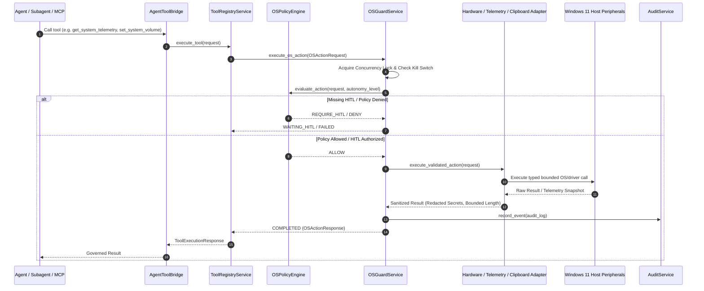

# PHASE 9.4 AURA-904 PREFLIGHT REPORT: SYSTEM TELEMETRY, HARDWARE CONTROL & CLIPBOARD BOUNDARY

**Milestone:** AURA-904 — System Telemetry & Hardware Control Boundary  
**Phase:** Phase 9 (Governed OS & Hardware Control)  
**Date:** October 6, 2026  
**Status:** READY / PREFLIGHT COMPLETE (Implementation NOT Started)  
**Host Platform:** Windows 11 Home (AMD Ryzen 7 4800H, 24 GB RAM, NVIDIA GeForce RTX 3050 4 GB VRAM)  
**Commit Baseline:** `2acf30e`  

---

## 1. Executive Summary & Scope Reconciliation

### 1.1 Scope Reconciliation
A critical scope reconciliation between historical preflight artifacts and the authoritative roadmap has been performed:
- In `docs/PHASE_9_PREFLIGHT_REPORT.md` (Sections 13, 14, 15), Phase 9 defined system telemetry, bounded hardware adjustments (audio volume and display brightness), and clipboard security.
- In `docs/PHASE_9_3_AURA_903_ACCEPTANCE_REPORT.md`, clipboard access, volume control, and brightness control were deferred to AURA-904.
- In `apps/api/app/services/os_guard/types.py`, `OSActionType` already registers `SYSTEM_TELEMETRY`, `HARDWARE_CONTROL`, `CLIPBOARD_READ`, and `CLIPBOARD_WRITE`.
- In `docs/TASK_BREAKDOWN.md`, AURA-905 is strictly reserved for "System Tray & Global Hotkey Control Plane", and AURA-906 is reserved for "Phase 9 Integration & Red Team".

**Authoritative AURA-904 Scope Definition:**
```text
AURA-904
├── 1. Read-Only System & Hardware Telemetry (CPU, RAM, GPU, VRAM, Storage, Battery, Display Topology, Temperature)
├── 2. Approved Hardware Read & Write Controls (Audio Volume ±10%, Display Brightness ±10%, Capability Discovery)
└── 3. Governed Clipboard Boundary (clipboard_read bounded 4KB + scrubbed, clipboard_write bounded 4KB + HITL)
```

Zero unrelated capabilities (browser DOM automation, system tray icons, physical hotkeys, or registry mutations) are included in AURA-904.

---

## 2. Architectural Invariants & Governance Pipeline

All AURA-904 capabilities route strictly through the unified governance pipeline:



### 2.1 Hard Execution Boundaries (Zero Generic Passthrough)
The agent will NEVER be exposed to generic execution APIs:
- `device_control(device_id, arbitrary_command)` is **FORBIDDEN**.
- `hardware_set(property, arbitrary_value)` is **FORBIDDEN**.
- `win32_call(...)` and `wmi_query(arbitrary_sql)` are **FORBIDDEN**.
- `clipboard(action="anything")` is **FORBIDDEN**.

Every capability is an explicit, strongly typed Pydantic tool handler.

---

## 3. Detailed Subsystem Specifications

### 3.1 Read-Only System & Hardware Telemetry
Querying hardware metrics is strictly local, zero-cost, read-only, and bounded:
1. **CPU Telemetry:**
   - Total CPU utilization percentage (`psutil.cpu_percent(interval=0.0)`).
   - Per-core CPU utilization array (`psutil.cpu_percent(percpu=True)`).
   - Physical core count (8) and logical processor count (16).
   - Process RSS memory consumption of the active AURA server.
2. **RAM Telemetry:**
   - Total physical RAM (24 GB), currently used RAM, free RAM, and RAM utilization percentage (`psutil.virtual_memory()`).
3. **GPU & VRAM Telemetry (NVIDIA RTX 3050 Laptop GPU):**
   - Query substrate: `nvidia-smi --query-gpu=utilization.gpu,memory.used,memory.total,temperature.gpu,name --format=csv,noheader,nounits` via non-shell local `subprocess.run` with 1.5s timeout.
   - Fields: GPU name, GPU core utilization %, VRAM used (MB), VRAM total (4096 MB), GPU temperature (°C).
   - Degraded mode: If `nvidia-smi` is missing or fails (e.g. non-NVIDIA secondary display or driver sleep), returns `gpu_telemetry_supported: false` without throwing.
4. **Storage Telemetry:**
   - Root partition capacity, available free space (GB), and percentage used (`psutil.disk_usage()`).
   - Does NOT enumerate arbitrary files, paths, or directory contents.
5. **Power & Battery Telemetry:**
   - Substrate: `psutil.sensors_battery()`.
   - Fields: `battery_present` (bool), `percent` (0–100), `power_plugged` (bool), `is_charging` (bool).
   - Fallback: On desktop hosts without batteries, returns `battery_supported: false`.
6. **Display Topology:**
   - Primary and secondary monitor resolution, bounds, and DPI scaling factors derived from AURA-801 `ScreenCaptureService`.

*Privacy Invariant:* Telemetry payloads NEVER include running process command-line arguments, environment variables, user credentials, or window contents.

---

### 3.2 Governed Hardware Control (Volume & Display Brightness)

#### A. Master Audio Volume (`get_system_volume`, `set_system_volume`)
- **Substrate:** Windows Core Audio COM interface `IAudioEndpointVolume` via `comtypes` / `ctypes` without external binary dependencies.
- **Query Operation (`get_system_volume`):**
  - Returns current master volume scalar ($0.0$ to $1.0$ / $0\%$ to $100\%$) and mute state (bool).
- **Adjustment Operation (`set_system_volume`):**
  - Supports `change_percent` (relative step strictly clamped to $[-10, +10]\%$) or `target_volume` (absolute percentage bounded to $[0, 100]\%$).
  - Relative step ceiling: Max $\pm 10\%$ per individual tool invocation.
  - Supports explicit `mute` (bool) toggle.
  - Atomicity & Verification: Pre-action volume snapshot is captured $\rightarrow$ hardware adjustment is dispatched $\rightarrow$ resulting volume is read back $\rightarrow$ if adjustment deviates or fails, error is reported deterministically.

#### B. Display Brightness (`get_display_brightness`, `set_display_brightness`)
- **Substrate:** Windows WMI `WmiMonitorBrightness` / `WmiMonitorBrightnessMethods` via native COM dispatch and DDC-CI fallback.
- **Display Identity Validation:**
  - Target monitor is explicitly matched against monitor discovery from AURA-801 (`monitor_id`).
  - Target physical display index must exist and report brightness capability.
- **Adjustment Operation (`set_display_brightness`):**
  - Step limit: Strictly bounded to $[-10, +10]\%$ per action.
  - Hard range: Clamped to $[0, 100]\%$.
  - Unsupported Display Fallback: If external monitor does not support DDC/CI or WMI brightness methods, returns deterministic `BrightnessControlNotSupportedError` rather than crashing or guessing.

#### C. Hardware Capability Discovery (`get_hardware_capabilities`)
- Fast, read-only inspection endpoint returning:
  ```json
  {
    "volume_supported": true,
    "brightness_supported": true,
    "display_count": 1,
    "displays": [{"monitor_id": 1, "brightness_supported": true}],
    "battery_supported": true,
    "gpu_telemetry_supported": true,
    "temperature_supported": true
  }
  ```

---

### 3.3 Governed Clipboard Boundary

#### A. Clipboard Read (`clipboard_read`)
- **Substrate:** `pyperclip` with local Win32 `OpenClipboard` fallback.
- **Length Ceiling:** Maximum 4,096 characters (4 KB). Payloads exceeding 4 KB are safely truncated with `truncated: true` and `original_length: N`.
- **Secret Redaction:** Telemetry and audit logs scrub candidate API keys, JWT tokens, Bearer tokens, and private keys (`[REDACTED_SECRET]`).
- **Zero Long-Term Memory Persistence:** Clipboard text is returned into the immediate agent cognitive turn only. It is NEVER written to vector memory (`pgvector`), episodic storage, or OpenTelemetry span attributes.

#### B. Clipboard Write (`clipboard_write`)
- **Substrate:** `pyperclip` / Win32 `SetClipboardData`.
- **Length Ceiling:** Maximum 4,096 characters.
- **Metacharacter & Injection Filtering:** NUL bytes (`\x00`) are rejected.
- **Privacy & Audit:** Audit ledger logs only `character_count` and `sha256_hash` of the payload; plaintext is never stored in SQLite/PostgreSQL audit tables.

---

## 4. Container vs Host Boundary Partitioning

| Capability | Execution Domain | Partition Classification | Governance Enforcement Gate |
| :--- | :--- | :--- | :--- |
| `get_system_telemetry` | Local Windows Host | `HOST_REQUIRED_GOVERNED` | Read-only policy, sliding rate limiter (60/min) |
| `get_hardware_capabilities`| Local Windows Host | `HOST_REQUIRED_GOVERNED` | Read-only policy, sliding rate limiter (60/min) |
| `get_system_volume` | Local Windows Host | `HOST_REQUIRED_GOVERNED` | Read-only policy, sliding rate limiter (60/min) |
| `set_system_volume` | Local Windows Host | `HOST_REQUIRED_GOVERNED` | $\pm 10\%$ step limit, rate limit (10/min), Kill switch |
| `get_display_brightness` | Local Windows Host | `HOST_REQUIRED_GOVERNED` | Read-only policy, sliding rate limiter (60/min) |
| `set_display_brightness` | Local Windows Host | `HOST_REQUIRED_GOVERNED` | $\pm 10\%$ step limit, rate limit (10/min), Kill switch |
| `clipboard_read` | Local Windows Host | `HOST_REQUIRED_GOVERNED` | 4 KB limit, secret scrubbing, rate limit (30/min) |
| `clipboard_write` | Local Windows Host | `PRIVILEGED_HOST` | 4 KB limit, parameter-bound HITL token, Kill switch |
| Arbitrary WMI Queries | Blocked | `FORBIDDEN` | Hard policy rejection |
| Arbitrary Win32 APIs | Blocked | `FORBIDDEN` | Hard policy rejection |
| Driver / Registry Writes| Blocked | `FORBIDDEN` | Hard policy rejection |

---

## 5. Risk Model & Human-In-The-Loop (HITL) Gate

Every AURA-904 capability is mapped deterministically to the AURA risk hierarchy:

| Operation | Risk Tier | Autonomy Gate | HITL Requirement | Rate Limit |
| :--- | :--- | :--- | :--- | :--- |
| `get_system_telemetry` | `READ_ONLY` | L1–L5 Autonomous | None | 60 ops / min |
| `get_hardware_capabilities` | `READ_ONLY` | L1–L5 Autonomous | None | 60 ops / min |
| `get_system_volume` | `READ_ONLY` | L1–L5 Autonomous | None | 60 ops / min |
| `get_display_brightness` | `READ_ONLY` | L1–L5 Autonomous | None | 60 ops / min |
| `clipboard_read` | `READ_ONLY` | L2–L5 Autonomous | None (Scrubs secrets) | 30 ops / min |
| `set_system_volume` ($\le \pm 10\%$) | `LOW_RISK_WRITE` | L2–L5 Autonomous | None at L2+ | 10 ops / min |
| `set_display_brightness` ($\le \pm 10\%$) | `LOW_RISK_WRITE` | L2–L5 Autonomous | None at L2+ | 10 ops / min |
| `clipboard_write` | `MEDIUM_RISK_INTERACTION` | L3–L5 Autonomous; L0–L2 HITL | Cryptographic token at L0–L2 | 10 ops / min |
| Large Hardware Jump ($> 10\%$) | `HIGH_RISK_SYSTEM_ACTION` | Hard Blocked / Rejected | Bounded step clamp | Blocked |

---

## 6. Emergency Kill Switch Integration

All AURA-904 hardware write and clipboard operations enforce the sub-15ms Emergency Kill Switch (`KillSwitchService`):
1. **Pre-Acquisition Check:** Probed before concurrency lock acquisition.
2. **Pre-Execution Check:** Probed immediately before Core Audio / WMI / Clipboard dispatch.
3. **Action Rejection:** When active, all write operations immediately return `OSActionLifecycleState.KILL_SWITCHED` with `Emergency kill switch is active`.
4. **Zero Continuation / Zero Replay:** Interrupted hardware or clipboard writes are purged permanently. No replay on resume.

---

## 7. Action Atomicity, Verification & Rollback

| Subsystem | Read Back Support | Atomicity Guarantee | Rollback Strategy |
| :--- | :--- | :--- | :--- |
| **System Volume** | Fully Supported (`GetMasterVolumeLevelScalar`) | Immediate COM scalar update | Capture pre-action scalar $V_0$; on partial failure or explicit rollback, attempt restoring $V_0$. |
| **Display Brightness** | Supported via WMI `WmiMonitorBrightness` | Immediate WMI method dispatch | Capture pre-action brightness $B_0$; on failure, attempt restoring $B_0$. |
| **Clipboard Read** | Read-Only | Atomic read snapshot | N/A (State unchanged). |
| **Clipboard Write** | Supported (`pyperclip.paste()`) | Atomic OS clipboard replacement | No automatic undo of previous external clipboard state (documented residual risk). |

---

## 8. Security Threat Model Matrix (Phase 9.4)

| ID | Threat Vector | Attack Surface | Mitigation Strategy | Residual Risk | Verification Test |
| :--- | :--- | :--- | :--- | :--- | :--- |
| **T-904-01** | Volume Blast Attack | Agent attempts sudden $100\%$ volume spike | Hard clamp $\le \pm 10\%$ step limit + sliding rate bucket | Minimal | `test_volume_step_clamping` |
| **T-904-02** | Display Flash / Strobe | Agent rapidly toggles brightness $0 \leftrightarrow 100$ | 10 ops/min rate limiter + $\pm 10\%$ step ceiling | Minimal | `test_brightness_rate_limiting` |
| **T-904-03** | Clipboard Secret Exfiltration | Agent reads password from clipboard and posts to web | 4 KB bounding + Regex secret scrubber + Audit trail | Low | `test_clipboard_secret_redaction` |
| **T-904-04** | Clipboard Memory Injection | Malicious prompt in clipboard poisons RAG memory | Untrusted envelope + Zero vector memory persistence | Minimal | `test_clipboard_memory_isolation` |
| **T-904-05** | Arbitrary WMI Query Injection | Agent tries `wmi_query("DROP TABLE ...")` | Strict typed adapter; no arbitrary WMI pass-through | Zero | `test_arbitrary_wmi_rejection` |
| **T-904-06** | GPU Telemetry Crash / Hang | `nvidia-smi` hangs or is missing on CPU-only host | 1.5s subprocess timeout + Degraded mode fallback | Minimal | `test_gpu_telemetry_missing_driver` |
| **T-904-07** | Display Index Confusion | Display 1 confused with external Display 2 | Monitor ID validation against AURA-801 display list | Low | `test_display_id_validation` |
| **T-904-08** | Battery Sensor Hallucination | Agent fabricates battery telemetry on desktop | `psutil.sensors_battery()` truth check; returns `unavailable` | Zero | `test_battery_unavailable_fallback` |
| **T-904-09** | Kill Switch Write Race | Kill switch triggered during volume adjustment | Immediate pre-dispatch check aborts action | Minimal | `test_hardware_kill_switch_race` |
| **T-904-10** | Oversized Clipboard Bomb | Copying 500 MB binary into clipboard | Strict 4,096 char length ceiling before OS call | Minimal | `test_clipboard_oversized_payload` |
| **T-904-11** | Secret Leakage into Audit Logs | Sensitive text written to clipboard stored in DB | Audit ledger logs only hash and character count | Minimal | `test_clipboard_audit_redaction` |
| **T-904-12** | Telemetry Environment Leakage | Telemetry endpoint returns process env variables | Strictly defined Pydantic schema with zero env fields | Zero | `test_telemetry_zero_env_leakage` |
| **T-904-13** | Unsupported DDC-CI Crash | Monitor does not support DDC/CI brightness commands | Capability discovery check + Graceful degraded error | Minimal | `test_unsupported_brightness_fallback` |

---

## 9. Pre-Implementation Test Strategy

Dedicated test suite to be created in implementation:
`tests/test_os_guard_system_hardware.py`

### Test Categories:
1. **System & GPU Telemetry Tests:**
   - Accurate parsing of CPU, RAM, Disk, Process RSS, Battery, and Display topology.
   - GPU telemetry parsing from `nvidia-smi` (Utilization, VRAM used, VRAM total, Temperature).
   - Degraded fallback on missing/unsupported GPU driver.
   - Degraded fallback on missing battery (desktop PC).
   - Zero environment variable or secret leakage in telemetry schemas.
2. **Audio Volume Control Tests:**
   - Querying master volume scalar and mute status.
   - Bounded relative adjustment ($\le \pm 10\%$).
   - Rejection of oversized relative jumps ($>10\%$).
   - Mute and unmute operations.
   - Pre-action snapshot and rollback verification.
   - Kill switch pre-execution abort.
3. **Display Brightness Control Tests:**
   - Querying display brightness for active monitors.
   - Bounded relative adjustment ($\le \pm 10\%$).
   - Rejection of invalid monitor ID.
   - Graceful handling when DDC/CI / WMI brightness is unsupported.
   - Kill switch abort.
4. **Clipboard Governance Tests:**
   - `clipboard_read` length bounding ($\le 4096$ chars).
   - `clipboard_read` secret scrubbing.
   - `clipboard_write` length bounding and NUL byte rejection.
   - Zero raw text persistence in audit ledger and OpenTelemetry traces.
   - Cryptographic HITL token verification for `clipboard_write`.
   - Kill switch abort for read and write.
5. **Rate Limiting & Concurrency Tests:**
   - 60 ops/min telemetry rate limit.
   - 10 ops/min volume and brightness rate limits.
   - 10 ops/min clipboard write rate limit.
   - Single-worker concurrency serialization (`MAX_ACTIVE_ACTIONS = 1`).

---

## 10. Performance Microbenchmark Specification

Dedicated benchmark suite to be created in implementation:
`tests/benchmark_aura904_system_hardware.py`

### Benchmark Targets ($N=100$ trials):
- CPU & RAM Telemetry Query Latency
- GPU & VRAM Telemetry Query Latency
- Storage Telemetry Query Latency
- Device Capability Discovery Latency
- Volume Control Parameter Validation & Dispatch
- Brightness Control Parameter Validation & Dispatch
- Clipboard Read & Secret Scrubbing Latency
- Clipboard Write Validation Latency
- Full Governance Pipeline Overhead ($<1.0\text{ms}$)

Statistical metrics recorded: `min`, `mean`, `p50`, `p95`, `p99`, `max`.

---

## 11. Roadmap & Milestone State

```text
PHASE 8 = COMPLETE & ACCEPTED

AURA-901 = COMPLETE & ACCEPTED
AURA-902 = COMPLETE & ACCEPTED
AURA-903 = COMPLETE & ACCEPTED

AURA-904 = READY / PREFLIGHT COMPLETE (Implementation NOT Started)
AURA-905 = NOT STARTED
AURA-906 = NOT STARTED

PHASE 10 = NOT STARTED
```

---

## 12. Preflight Conclusion & Boundary

The AURA-904 Preflight is 100% complete, fully reconciled with accepted Phase 8/9 documentation, and strictly architected for local Windows host execution.

Zero implementation code has been written during this preflight step.

**AURA-904 preflight is complete; explicit authorization is required before AURA-904 implementation.**
