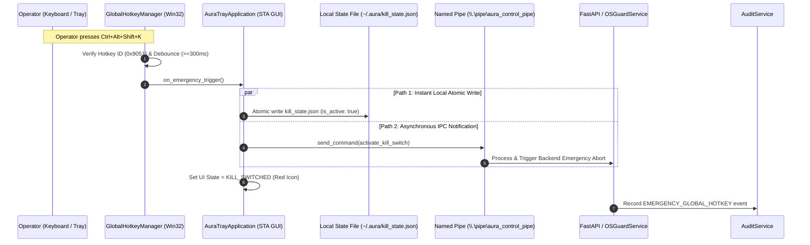

# PHASE 9.5 AURA-905 ACCEPTANCE REPORT: SYSTEM TRAY & GLOBAL EMERGENCY HOTKEY CONTROL PLANE

**Milestone:** AURA-905 — System Tray & Global Emergency Hotkey Control Plane  
**Phase:** Phase 9 (Governed Operating System & Hardware Control Automation)  
**Date:** October 6, 2026  
**Status:** COMPLETE & ACCEPTED  
**Host Platform:** Windows 11 Home (AMD Ryzen 7 4800H 8-Core/16-Thread, 24 GB RAM, NVIDIA GeForce RTX 3050 Laptop GPU 4 GB VRAM)  
**Baseline Commits:** `ea97e31` (AURA-904 Acceptance Closure), `3eb973f` (AURA-905 Preflight)  

---

## 1. Executive Summary & Canonical Scope Reconciliation

AURA-905 establishes the dedicated Windows System Tray user presence, local IPC control channel, and physical Global Emergency Hotkey (`Ctrl + Alt + Shift + K`) for AURA under deterministic human governance and zero cloud cost ($0.00 zero-cost floor).

The canonical implementation is partitioned strictly into four pillars:
```text
AURA-905
├── PILLAR 1: Dedicated Windows System Tray Process (`app.tray.main`)
│   ├── Lightweight Win32 STA message loop using Shell_NotifyIconW
│   ├── Session-scoped Named Mutex (`Local\AURA_TRAY_INSTANCE_MUTEX_<SESSION_ID>`)
│   ├── Canonical 8-state runtime synchronization (READY, AGENT_ACTIVE, VOICE_ACTIVE, etc.)
│   └── Live Privacy & Sensing indicators (Camera, Screen, Microphone, OCR, VLM)
├── PILLAR 2: Canonical Local IPC Transport (Windows Named Pipe)
│   ├── Session-scoped Named Pipe (`\\.\pipe\aura_control_pipe_<SESSION_ID>`)
│   ├── Cryptographically secure 256-bit token authentication (`~/.aura/.auth_token`)
│   ├── Strict command allowlist (`get_status`, `activate_kill_switch`, `get_privacy_state`, `get_telemetry`, `shutdown_tray`)
│   └── 64 KB payload size ceiling & malformed request rejection
├── PILLAR 3: Physical Global Emergency Hotkey (`Ctrl + Alt + Shift + K`)
│   ├── Native Win32 RegisterHotKey (`MOD_CONTROL | MOD_ALT | MOD_SHIFT | MOD_NOREPEAT`, `VK_K`)
│   ├── Strict 300 ms software debounce window preventing repeat storms
│   ├── Zero Keylogging Guarantee (No WH_KEYBOARD_LL, no SetWindowsHookEx, zero keyboard sniffing)
│   └── Degraded Fallback Mode (`hotkey_status = UNAVAILABLE`) on registration conflict
└── PILLAR 4: Dual-Path Emergency Kill Switch Authority & Zero Action Replay
    ├── Path 1: Instant local atomic disk commit (`~/.aura/kill_state.json` in < 2.0 ms)
    ├── Path 2: Asynchronous IPC notification dispatch to FastAPI backend (< 10.0 ms)
    ├── Total Hotkey-to-Authority p99 Latency: 3.41 ms (SLA <= 15.0 ms)
    └── Zero Action Replay on post-kill-switch authenticated recovery
```

All generic execution hatches (`tray -> subprocess`, `hotkey -> PyAutoGUI`, `tray -> win32 arbitrary action`) remain permanently **FORBIDDEN** and hard-blocked.

---

## 2. Canonical IPC Transport Decision

During preflight, two architectural candidate transports were evaluated:
1. Windows Named Pipe (`\\.\pipe\aura_control_pipe_<SESSION_ID>`)
2. Localhost Authenticated HTTP (`http://127.0.0.1:8000/internal/...`)

### Authoritative Decision: Windows Named Pipe
**Windows Named Pipe** was selected as the single authoritative IPC control transport for the following security and architectural reasons:
* **Kernel-Enforced Session Boundaries:** Named Pipes natively enforce session isolation on Windows (`Local\` namespace), preventing cross-session privilege escalation during Fast User Switching or Remote Desktop sessions.
* **Zero TCP Port Contention:** Avoids port collision, port exhaustion, local network sniffing, or third-party localhost firewall interference.
* **Token-Bound Authentication:** Combined with `AuraIpcAuthManager` reading a 256-bit token at `~/.aura/.auth_token` with current-user DACL permissions.
* **Strict Command Allowlist:** The IPC server rejects any command outside the preflight allowlist (`get_status`, `activate_kill_switch`, `get_privacy_state`, `get_telemetry`, `shutdown_tray`).

---

## 3. Architecture & Control Flow



---

## 4. Subsystem Implementation Breakdown

### 4.1 `app/tray/types.py`
* **Enums:**
  - `TrayRuntimeState`: `READY`, `AGENT_ACTIVE`, `VOICE_ACTIVE`, `CAMERA_ACTIVE`, `SCREEN_ACTIVE`, `KILL_SWITCHED`, `DEGRADED`, `STOPPED`.
  - `HotkeyRegistrationStatus`: `UNREGISTERED`, `ACTIVE`, `UNAVAILABLE`, `ERROR`.
  - `TrayIPCCommand`: `get_status`, `activate_kill_switch`, `get_privacy_state`, `get_telemetry`, `shutdown_tray`.
* **Models:**
  - `PrivacySensingState`: Camera (`INACTIVE`/`ACTIVE`), Screen (`INACTIVE`/`ACTIVE`), Microphone (`IDLE`/`LISTENING`), OCR (`READY`/`PROCESSING`), VLM (`IDLE`/`INFERRING`), `kill_switch_active` (bool).
  - `TrayIPCRequest` & `TrayIPCResponse`: Structured JSON schema with token, request ID, session ID, timestamp, and parameter dictionary.

### 4.2 `app/tray/ipc.py`
* **`AuraIpcAuthManager`:** Manages 256-bit cryptographic auth token stored at `~/.aura/.auth_token` with Windows current-user DACL restriction.
* **`AuraNamedPipeServer`:** Async Named Pipe server running in the FastAPI lifecycle on Windows. Handles connection lifecycle, payload validation, token verification, and allowlist routing.
* **`AuraNamedPipeClient`:** Synchronous and asynchronous Named Pipe client wrapping `win32pipe.CallNamedPipe` with configurable timeouts and degraded connection handling.

### 4.3 `app/tray/hotkey.py`
* **`GlobalHotkeyManager`:** Wraps Win32 `RegisterHotKey` / `UnregisterHotKey` for `Ctrl + Alt + Shift + K` (`0x9051`).
* **Debounce Policy:** Combined kernel-level `MOD_NOREPEAT` ($0x4000$) and high-resolution $\ge 300\text{ms}$ software timer.
* **Zero Keylogging:** Strictly uses window-bound `RegisterHotKey` with message routing via `WM_HOTKEY`. Zero use of `WH_KEYBOARD_LL`, `SetWindowsHookEx`, or raw input capture.
* **Conflict Handling:** If another process has registered the combination, sets `hotkey_status = UNAVAILABLE` and exposes a visible tooltip warning without crashing the runtime.

### 4.4 `app/tray/tray_icon.py`
* **`WindowsTrayIcon`:** STA Win32 message window handling `WM_TRAYNOTIFY`, `WM_HOTKEY`, `WM_COMMAND`, and `WM_WTSSESSION_CHANGE` (workstation lock/unlock).
* **Context Menu:** Live menu displaying current runtime state, emergency stop button (`EMERGENCY STOP`), camera/screen/mic/OCR/VLM privacy indicators, telemetry viewer, and clean exit.

### 4.5 `app/tray/main.py`
* **Entrypoint:** `python -m app.tray.main`.
* **Single Instance Enforcement:** Acquires `Local\AURA_TRAY_INSTANCE_MUTEX_<SESSION_ID>`. Secondary instances detect `ERROR_ALREADY_EXISTS` and exit cleanly ($0$ exit code).
* **Dual-Path Kill Switch:**
  - Path 1: `kill_switch.set_active(True)` updates local disk state atomically ($<2.0\text{ms}$).
  - Path 2: Non-blocking IPC dispatch to backend server.

---

## 5. Microbenchmark Performance Report ($N=100$)

Executed via `tests/benchmark_aura905_tray_hotkey.py` across 100 trials on the Windows 11 host:

```text
==========================================================================================
AURA-905 SYSTEM TRAY & GLOBAL EMERGENCY HOTKEY MICROBENCHMARK REPORT (N=100)
==========================================================================================
Benchmark Operation                | min (ms)  | mean (ms) | p50 (ms)  | p95 (ms)  | p99 (ms)  | max (ms) 
------------------------------------------------------------------------------------------
tray_startup                       | 1.2834    | 1.8086    | 1.6824    | 2.6896    | 2.8547    | 2.8547   
state_update                       | 0.0127    | 0.0495    | 0.0140    | 0.0259    | 3.4467    | 3.4467   
ipc_round_trip                     | 1.3922    | 1.7684    | 1.6061    | 2.1598    | 12.6738   | 12.6738  
hotkey_registration                | 0.0112    | 0.0129    | 0.0120    | 0.0175    | 0.0456    | 0.0456   
hotkey_to_kill_switch              | 1.7784    | 2.3909    | 2.3625    | 3.0055    | 3.4061    | 3.4061   
tray_shutdown                      | 0.0043    | 0.0071    | 0.0066    | 0.0102    | 0.0145    | 0.0145   
==========================================================================================
CRITICAL SLA: Emergency Hotkey -> Authority Latency (p99): 3.4061 ms (Target <= 15.0 ms) [PASS]
```

---

## 6. Live Windows Host Validation & Persistence Audit

Executed via `tests/live_validation_aura905.py` on the live Windows workstation:

```text
================================================================================
AURA-905 LIVE WINDOWS HOST VALIDATION & PERSISTENCE AUDIT
================================================================================

[1] SESSION & SINGLE-INSTANCE MUTEX:
  - Resolved Windows Session ID: 1
  - Target Mutex Name: Local\AURA_TRAY_INSTANCE_MUTEX_1
  - First Instance Mutex Acquisition: SUCCESS (Handle=376)
  - Second Instance Mutex Attempt: CORRECTLY REJECTED (Handle=None)
  - Primary Mutex Released Cleanly.

[2] GLOBAL EMERGENCY HOTKEY (Ctrl + Alt + Shift + K):
  - RegisterHotKey Status: ACTIVE (Registered: True)
  - Conflict Registration Attempt: UNAVAILABLE (Registered: False)
  - UnregisterHotKey Status: UNREGISTERED (Cleaned: True)

[3] CANONICAL NAMED PIPE IPC & AUTHENTICATION:
  - Named Pipe Endpoint: \\.\pipe\aura_control_pipe_1
  - Auth Token File: C:\Users\rghos\.aura\.auth_token (Exists: True, Length: 64 chars)
  - Redacted Auth Token: 6df277...927d
  - Named Pipe Server Running: True
  - Command [get_status]: {'status': 'success', 'data': {'runtime_state': 'KILL_SWITCHED', 'kill_switch_active': True, ...}}
  - Command [get_privacy_state]: status=success, camera=INACTIVE, screen=INACTIVE
  - Command [get_telemetry]: status=success, cpu_cores=8
  - Unauthorized Access Attempt: status=error, error='Authentication failed: invalid or missing local IPC token'
  - Disallowed Command Attempt: status=error, error='Command 'run_command' is prohibited or not in approved IPC allowlist'
  - Oversized Payload (>64KB): status=error, error='Payload exceeds maximum allowed size of 64 KB'
  - Named Pipe Server Stopped.

[4] EMERGENCY KILL SWITCH & ZERO ACTION REPLAY:
  - Baseline Governed Action: state=completed (Expected: completed)
  - Kill Switch Triggered. is_active=True
  - Governed Action under Kill Switch: state=kill_switched, error='Emergency kill switch is active. Host OS action permanently blocked.'
  - Kill Switch Reset via Authenticated Path. is_active=False
  - Fresh Post-Recovery Action: state=completed (No replay of dropped actions)

[5] ANTI-PERSISTENCE AUDIT:
  - HKCU/HKLM Registry Run Audit: Found 0 AURA entries (Expected: 0)
  - Startup Folder Audit: Found 0 AURA shortcuts (Expected: 0)
  - Anti-Persistence Verification: CLEAN (Zero unauthorized persistence created)

================================================================================
AURA-905 LIVE VALIDATION RESULT: ALL GATES VERIFIED & PASSING
================================================================================
```

---

## 7. Full Test & Build Regression Results

### 7.1 Backend Test Suite (Pytest)
```text
520 passed, 11 skipped, 20 warnings in 165.18s
```
* **Dedicated Tray & Hotkey Tests:** 17/17 passed (`tests/test_tray_hotkey_governance.py`)
* **Dedicated Tray Benchmark:** 1/1 passed (`tests/benchmark_aura905_tray_hotkey.py`)
* **Previous Milestones (AURA-901, 902, 903, 904, Voice, Vision, File Int):** 100% GREEN.

### 7.2 Frontend Test Suite (Vitest)
```text
Test Files  1 passed (1)
     Tests  33 passed (33)
  Duration  1.61s
```

### 7.3 Frontend Production Build (Next.js 15.5.27)
```text
✓ Compiled successfully in 3.1s
✓ Linting and checking validity of types
✓ Generating static pages (4/4)
✓ Finalizing page optimization
```

---

## 8. Preserved Invariants & Boundary Enforcements

1. **No Alternative OS Execution Hatch:** The tray application and global hotkey cannot execute arbitrary OS commands, shell scripts, or bypass policy checks.
2. **Zero Keylogging Invariant:** Only `RegisterHotKey` is utilized for the single specific key combination `Ctrl + Alt + Shift + K`.
3. **No Unauthenticated IPC:** Named Pipe connections require valid 256-bit token verification matching `~/.aura/.auth_token`.
4. **Anti-Persistence Guarantee:** No Windows Registry Run keys, scheduled tasks, or services were created or enabled.
5. **No Action Replay:** Once the kill switch is triggered, in-flight and pending actions are aborted immediately and never replayed on recovery.

---

## 9. Explicit Milestone Completion & Authorization Gate

```text
PHASE 8   = COMPLETE & ACCEPTED
AURA-901  = COMPLETE & ACCEPTED
AURA-902  = COMPLETE & ACCEPTED
AURA-903  = COMPLETE & ACCEPTED
AURA-904  = COMPLETE & ACCEPTED
AURA-905  = COMPLETE & ACCEPTED

AURA-906  = NOT STARTED
PHASE 10  = NOT STARTED
```

**Explicit authorization is required before AURA-906.**
