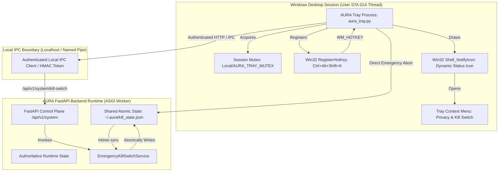
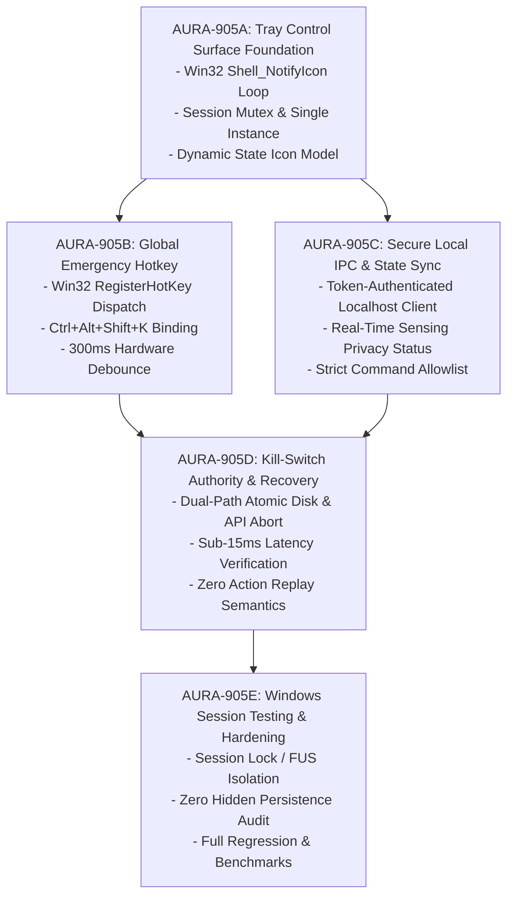

# PHASE 9.5 AURA-905 PREFLIGHT REPORT: SYSTEM TRAY & GLOBAL HOTKEYS

**Milestone:** AURA-905 — System Tray & Global Hotkeys Control Plane  
**Phase:** Phase 9 (Governed Operating System & Hardware Control Automation)  
**Date:** October 6, 2026  
**Status:** READY / PREFLIGHT COMPLETE (Implementation NOT Started)  
**Baseline Commit:** `ea97e31` (AURA-904 Final Acceptance Closure)  
**Regression Baseline:** 503 Backend Pytest Passes (11 Skipped, 0 Failed) | 33 Frontend Vitest Passes | Next.js 15.5.27 Production Build Passed  
**Target Hardware:** AMD Ryzen 7 4800H (8C/16T), 24 GB DDR4 RAM, NVIDIA GeForce RTX 3050 Laptop GPU (4 GB VRAM), Windows 11 Home  

---

## 1. Executive Summary & Authoritative Baseline

AURA-905 defines the architectural contract for the local Windows resident control surface of AURA:
1. **Windows System Tray Resident:** Real-time visual indicator of AURA runtime health, operational status, sensing privacy indicators (Screen, Camera, Microphone, OCR, Vision VLM), and instant access to the emergency control plane.
2. **Global Emergency Hotkey (`Ctrl + Alt + Shift + K`):** Low-level physical interrupter registered directly via native Windows API (`RegisterHotKey`) to trigger the sub-15ms Emergency Kill Switch independently of agent reasoning loops, web dashboards, or active window focus.

### Authoritative Baseline State:
```text
PHASE 8 = COMPLETE & ACCEPTED (Screen, Camera, OCR, VLM, Vision Tools, Vision HUD)

AURA-901 = COMPLETE & ACCEPTED (OS Guard Foundation, Risk Engine, 5-Tier Taxonomy, Lock)
AURA-902 = COMPLETE & ACCEPTED (Governed Application Launch, Allowlist, PID/CreateTime Reaping)
AURA-903 = COMPLETE & ACCEPTED (Governed PyAutoGUI Mouse & Keyboard, Coordinate Safety, Redaction)
AURA-904 = COMPLETE & ACCEPTED (System & GPU Telemetry, Master Volume, Brightness, Governed Clipboard)

AURA-905 PREFLIGHT = COMPLETE & READY
AURA-905 IMPLEMENTATION = NOT STARTED

AURA-906 = NOT STARTED (Integration & Red-Teaming)
PHASE 10 = NOT STARTED (Browser Action Suite & Boot Daemon)
```

**Critical Architectural Constraint:** AURA-905 is strictly a **Control-Plane / UI Indicator surface**, NOT an agent-capability expansion. The tray and hotkey layers provide human observability and physical emergency interruption. They do NOT provide new execution paths, do NOT bypass `OSGuardService` / `OSPolicyEngine`, and do NOT create background daemons or silent persistence.

---

## 2. Scope & Hard Exclusions

### 2.1 In-Scope Capabilities
- **System Tray Controller Process:** Dedicated lightweight Windows STA GUI process managing `Shell_NotifyIcon` tray lifecycle and context menu.
- **Dynamic State Visualization:** Visual icon and tooltip reflecting runtime state (`READY`, `AGENT_ACTIVE`, `VOICE_ACTIVE`, `CAMERA_ACTIVE`, `SCREEN_ACTIVE`, `KILL_SWITCHED`, `DEGRADED`, `STOPPED`).
- **Privacy State Indicators:** Menu items displaying live sensing status (Camera Active/Stopped, Screen Sensing Active/Stopped, Microphone Active/Stopped, OCR Active/Stopped, VLM Active/Stopped).
- **Physical Emergency Interruption:** Global key sequence `Ctrl + Alt + Shift + K` mapped directly to `EmergencyKillSwitchService` with hardware debounce ($\ge 300\text{ms}$).
- **Local IPC Communication:** Authenticated localhost / named pipe client querying backend runtime health and dispatching kill-switch commands.
- **Single-Instance Enforcement:** Session-scoped Windows Named Mutex preventing competing tray instances or duplicate hotkey registrations.

### 2.2 Hard Exclusions (Non-Negotiable)
- **NO Generic Execution Hatches:** No `tray -> subprocess`, `tray -> arbitrary OS action`, or `hotkey -> PyAutoGUI`.
- **NO Arbitrary Global Hotkeys:** Zero user-configurable or agent-configurable hotkeys for triggering general agent skills or workflow automations.
- **NO Keyboard Logging:** No global keyloggers, no `SetWindowsHookEx(WH_KEYBOARD_LL)` hook tracking general typing, and no keystroke interception beyond the single registered emergency hotkey tuple.
- **NO Silent Persistence:** No auto-creation of `HKCU\Software\Microsoft\Windows\CurrentVersion\Run` registry entries, no Task Scheduler jobs, and no Windows Service installation during AURA-905 (deferred to explicit user preference in Phase 10 `AURA-1003`).
- **NO Browser Automation or Cookie Manipulation:** Remains strictly deferred to Phase 10.
- **NO Bypass of Policy or Audit:** All state transitions and kill-switch invocations flow into cryptographic audit ledgers.

---

## 3. System Tray Architecture & Process Model



### 3.1 Dedicated Process Isolation Model
The System Tray runs as a separate, lightweight Python subprocess (`aura_tray.py` / `python -m app.tray.main`) rather than a background thread inside the FastAPI ASGI server:
1. **Crash Isolation:** If the API backend crashes, encounters an OOM condition, or enters a high-load compute loop, the tray process remains fully responsive to register user emergency inputs and display accurate degraded status.
2. **Win32 STA Message Pump:** Windows shell tray icons (`Shell_NotifyIcon`) and global hotkeys (`RegisterHotKey`) require a dedicated Single-Threaded Apartment (STA) GUI message loop (`GetMessage` / `TranslateMessage` / `DispatchMessage`). Isolating this loop from FastAPI's `asyncio` event loop prevents event loop starvation.
3. **Pure Native Win32 (`win32gui` / `ctypes`):** Implemented using native Win32 APIs already present in the workspace environment, avoiding external C-extension dependencies and keeping memory consumption $<15\text{ MB}$ RSS.

### 3.2 Single-Instance Mutex Guarantee
To prevent multiple tray instances from running concurrently in the same Windows desktop session (which would cause `RegisterHotKey` error 1409 `ERROR_HOTKEY_ALREADY_REGISTERED`):
- Upon startup, the tray process attempts to create a session-scoped Named Mutex:
  ```text
  Local\AURA_TRAY_INSTANCE_MUTEX_<SESSION_ID>
  ```
- If `GetLastError() == ERROR_ALREADY_EXISTS`, the secondary process logs an informative message, brings any existing AURA window to the foreground if applicable, and terminates immediately (`sys.exit(0)`).

---

## 4. Global Emergency Hotkey Governance

### 4.1 Canonical Hotkey Specification
- **Key Combination:** `Ctrl + Alt + Shift + K`
  - Win32 Modifiers: `MOD_CONTROL | MOD_ALT | MOD_SHIFT | MOD_NOREPEAT` ($0x0002 | 0x0001 | 0x0004 | 0x4000 = 0x4007$).
  - Virtual Key: `VK_K` ($0x4B$).
- **Rationale for 4-Key Sequence:** Highly resistant to accidental depression during standard productivity or gaming, yet ergonomically accessible during an immediate physical emergency.
- **`MOD_NOREPEAT` Flag:** Supported on Windows 7+ / 10 / 11 to ensure that holding the physical key combination down generates only **one** `WM_HOTKEY` message rather than an unbuffered flood of events.

### 4.2 Registration & Message Pump Lifecycle
1. **Registration:** During tray window initialization (`WM_CREATE`), call:
   ```c
   RegisterHotKey(hWnd, AURA_KILL_HOTKEY_ID, MOD_CONTROL | MOD_ALT | MOD_SHIFT | MOD_NOREPEAT, 'K');
   ```
2. **Event Dispatch:** In the window procedure (`WndProc`), on `WM_HOTKEY` matching `wParam == AURA_KILL_HOTKEY_ID`:
   - Enforce software debounce check: $\Delta t = t_{\text{now}} - t_{\text{last\_trigger}} \ge 300\text{ms}$.
   - Immediately execute **Emergency Kill Switch Sequence**.
   - Trigger tray visual state update to `KILL_SWITCHED`.
3. **Unregistration & Cleanup:** During tray shutdown (`WM_DESTROY`), call:
   ```c
   UnregisterHotKey(hWnd, AURA_KILL_HOTKEY_ID);
   ```

### 4.3 Conflict & Failure Handling (Degraded Mode)
If `RegisterHotKey` returns `FALSE` (e.g. another application has claimed the shortcut):
- The tray logs a warning with the Win32 error code (`GetLastError()`).
- The tray sets internal status `hotkey_status = UNAVAILABLE`.
- The tray menu displays a visible warning badge: `[⚠️ Emergency Hotkey: Unavailable (Conflict)]`.
- The system remains operational; the user can still trigger the emergency kill switch via the tray context menu or the web dashboard.
- AURA does **NOT** crash or abort startup when a hotkey conflict occurs.

---

## 5. Authoritative State Model & Privacy Indicators

### 5.1 Canonical 8-State Runtime Model
The System Tray visual icon and tooltip reflect the authoritative state of the local AURA runtime:

| State | Tray Icon Color / Badge | Tooltip Text | Description |
| :--- | :--- | :--- | :--- |
| `READY` | 🟢 Green / Cyan | "AURA: Ready & Idle" | Backend online, zero tasks active, sensors idle. |
| `AGENT_ACTIVE` | 🔵 Blue Pulsing | "AURA: Agent Executing..." | Cognitive loop / subagents active on a user task. |
| `VOICE_ACTIVE` | 🟣 Purple | "AURA: Voice Active" | Local VAD / STT / TTS audio streaming active. |
| `CAMERA_ACTIVE`| 🟡 Yellow Glow | "AURA: Live Camera Streaming" | WebSocket live camera ingestion active. |
| `SCREEN_ACTIVE`| 🟠 Orange | "AURA: Screen Sensing Active" | Continuous screen inspection / OCR active. |
| `KILL_SWITCHED`| 🔴 Bright Red Flash | "AURA: EMERGENCY STOPPED" | Kill switch triggered; all execution halted. |
| `DEGRADED` | ⚪ Gray / Warning | "AURA: Degraded / Disconnected" | Backend unreachable or hotkey unavailable. |
| `STOPPED` | ⚫ Dark Outline | "AURA: Backend Stopped" | Local API server offline. |

### 5.2 Real-Time Privacy State Menu
The tray context menu provides a dedicated "Privacy & Sensing Status" section:
```text
┌──────────────────────────────────────────────┐
│  AURA Agentic OS (v1.0.0)                   │
├──────────────────────────────────────────────┤
│  Status: READY                               │
│  Workspace: Default (Local)                  │
├──────────────────────────────────────────────┤
│  👁️ Privacy & Sensing Indicators:            │
│    • Live Camera:         [INACTIVE / OFF]   │
│    • Screen Capture:      [INACTIVE / OFF]   │
│    • Microphone Audio:    [IDLE]             │
│    • Local OCR Engine:    [READY]            │
│    • Moondream VLM:       [IDLE]             │
├──────────────────────────────────────────────┤
│  🛑 EMERGENCY KILL SWITCH (Ctrl+Alt+Shift+K) │
├──────────────────────────────────────────────┤
│  🌐 Open Web Dashboard (http://localhost:3000)│
│  📊 View System Telemetry                    │
│  🔄 Reconnect Backend                        │
├──────────────────────────────────────────────┤
│  ❌ Exit Tray                                │
└──────────────────────────────────────────────┘
```
*Note on Hardware Indicators:* The tray reports application-authoritative sensing states (e.g., `CameraSession.is_active`). It does NOT fabricate hardware-level LED reporting unless the Windows host OS exposes device sensor flags.

---

## 6. Emergency Kill Switch Authority Integration

### 6.1 Dual-Path Emergency Invocation (Sub-15ms Guarantee)
When the user presses `Ctrl+Alt+Shift+K` or selects "Emergency Kill Switch" from the tray menu, the tray executes a dual-path abort sequence:

```text
HOTKEY PRESSED (Ctrl+Alt+Shift+K)
       │
       ├──► PATH 1: Instant Local Atomic State Write (< 2.0 ms)
       │    Direct atomic file write to ~/.aura/kill_state.json
       │    (All local AURA workers/OSGuard detect mtime change instantly)
       │
       └──► PATH 2: Asynchronous HTTP Control Dispatch (< 10.0 ms)
            POST http://127.0.0.1:8000/api/v1/system/kill-switch
            (Triggers database task cancellation & audit ledger recording)
```

1. **Path 1 (Immediate Disk Sync):** The tray process immediately opens `~/.aura/kill_state.json`, writing `{"is_active_globally": true, "updated_at": <timestamp>, "actor_id": "system_tray_hotkey"}` via atomic temp file replacement.
   - `OSGuardService`, `managed_process_registry`, and subagent workers inspect `kill_switch.is_active()` before any action lock acquisition and driver dispatch. This halts any pending or queued OS actions within $<2.0\text{ms}$.
2. **Path 2 (API Abort Dispatch):** The tray dispatches an authenticated HTTP POST to `/api/v1/system/kill-switch`, triggering container teardown, MCP process termination, database task status updates (`cancelled`), and cryptographic audit logging.

### 6.2 Zero Replay Recovery Rule
- **Recovery Requires Explicit Human Action:** Activating the kill switch places the system into a persistent `KILL_SWITCHED` state.
- **No Automatic Resume:** The tray process remaining alive does NOT restart interrupted tasks.
- Interrupted mouse movements, keyboard typing, volume adjustments, application launches, or clipboard writes are permanently purged and can NEVER replay upon recovery.
- Restoration to `READY` requires an explicit, authenticated call to `/api/v1/system/kill-switch/reset` by an administrator/owner.

---

## 7. Local IPC & Authentication Architecture

### 7.1 Transport & Authentication
- **Transport:** Local loopback HTTP (`http://127.0.0.1:8000`) or Windows Named Pipe `\\.\pipe\aura_control_pipe_<session_id>`.
- **Authentication:** Shared local token file (`~/.aura/.auth_token`) generated during backend initialization with strict Windows file access control (`ACL: Current User Full Control Only`).
- **Header:** `Authorization: Bearer <local_token>` + `X-AURA-Caller: system_tray`.

### 7.2 Strict IPC Command Allowlist
The tray IPC client communicates exclusively with pre-approved endpoints:

| Endpoint / Command | Method | Purpose | Payload Constraints |
| :--- | :--- | :--- | :--- |
| `/api/v1/health` | `GET` | Backend availability check | None |
| `/api/v1/system/kill-switch/status` | `GET` | Poll authoritative kill state | None |
| `/api/v1/system/kill-switch` | `POST` | Trigger emergency abort | `{"reason": "Tray emergency stop"}` |
| `/api/v1/system/telemetry` | `GET` | Fetch system resource stats | None |
| `/api/v1/vision/status` | `GET` | Query active vision/camera status | None |

**Prohibited Commands:** The tray IPC client has zero interfaces for `execute_code`, `launch_app`, `write_clipboard`, or arbitrary command execution.

---

## 8. Windows Session & Multi-User Governance

1. **Session Locking (`WM_WTSSESSION_CHANGE` / `WTS_SESSION_LOCK`):**
   - When the Windows desktop is locked (`Win+L`), the tray enters a suspended monitoring state.
   - Hotkey inputs are safely ignored or queued by Windows until desktop unlock.
   - Sensing indicators transition to idle if screen capture is suspended during lock.
2. **Fast User Switching (FUS) & RDP Disconnects:**
   - Session-scoped mutex and pipe naming (`Local\AURA_TRAY_INSTANCE_MUTEX_<SESSION_ID>`) ensure that multiple logged-in Windows users run completely isolated tray processes.
   - User A's tray cannot query or control User B's AURA workspace.

---

## 9. Startup, Autostart & Anti-Persistence Policy

1. **Default Mode: Purely On-Demand Manual Startup:**
   - AURA-905 does NOT create automatic Windows startup entries by default.
   - No silent modifications to:
     - `HKCU\Software\Microsoft\Windows\CurrentVersion\Run`
     - `HKLM\Software\Microsoft\Windows\CurrentVersion\Run`
     - Windows Startup Folder (`%APPDATA%\Microsoft\Windows\Start Menu\Programs\Startup`)
     - Windows Task Scheduler (`schtasks`)
     - Windows Services (`sc.exe`)
2. **Phase 10 Future Provision:**
   - If an optional autostart capability is added in Phase 10 (`AURA-1003`), it must be:
     - Explicitly opted-in via a UI toggle setting.
     - 100% visible and documented.
     - Fully reversible with a single click.

---

## 10. Resource Budgets & Performance Targets

| Metric | Target / Ceiling | Measurement Method |
| :--- | :--- | :--- |
| **Tray Process RSS Memory** | $\le 15.0\text{ MB}$ | `psutil.Process().memory_info().rss` |
| **Idle CPU Utilization** | $< 0.1\%$ | `psutil.Process().cpu_percent()` over 60s |
| **Active Menu CPU Utilization**| $< 0.5\%$ | CPU utilization during menu open/navigation |
| **Hotkey-to-Kill-Switch Latency**| $\le 15.0\text{ ms}$ | Time from `WM_HOTKEY` to disk file atomic flush |
| **Tray State Polling Rate** | $1.0\text{ Hz}$ Idle / Event Push Active | Dynamic interval backing off when idle |
| **Debounce Enforcement Window**| $300\text{ ms}$ | High-resolution timer (`time.perf_counter`) |

---

## 11. Security Threat Model & Matrix

| # | Threat Vector | Attack Surface | Mitigation Strategy | Residual Risk | Verification Test |
| :- | :--- | :--- | :--- | :--- | :--- |
| 1 | **Duplicate Tray Process** | Competing hotkey registrations | Session-scoped Named Mutex; secondary exits immediately | None | `test_tray_single_instance_mutex` |
| 2 | **Hotkey Registration Conflict** | Another app owns `Ctrl+Alt+Shift+K` | Graceful degradation to `UNAVAILABLE` + visual menu warning | Minimal | `test_hotkey_registration_conflict_fallback` |
| 3 | **Rapid Key Repeat Flooding**| User/hardware holds hotkey down | Native `MOD_NOREPEAT` + 300ms software timer debounce | Minimal | `test_hotkey_debounce_and_no_repeat` |
| 4 | **Backend API Unreachable** | Backend crashed during emergency | Dual-path: instant local disk write (`kill_state.json`) | Minimal | `test_kill_switch_offline_disk_sync` |
| 5 | **IPC Message Forgery** | Local malware calling tray IPC | Shared `0600` local token + strict localhost binding | Low | `test_ipc_authentication_and_rejection` |
| 6 | **Cross-Session Leakage** | Fast User Switching on Windows | Session-scoped named objects (`Local\AURA_..._<SESSION_ID>`) | Zero | `test_session_isolation_and_scoping` |
| 7 | **Silent Persistence Injection**| Unwanted startup registry keys | Zero registry/task creation during installation/startup | Zero | `test_no_hidden_persistence_audit` |
| 8 | **Privilege Escalation via Tray**| Tray executing high-privilege actions | Tray is strictly a UI client; zero execution endpoints | Zero | `test_tray_has_no_execution_api` |
| 9 | **Stale Privacy Indicator State**| Disconnected sensing showing active | Periodic 1Hz heartbeat + state reset on disconnect | Minimal | `test_privacy_indicator_sync_and_disconnect` |
| 10| **Interrupted Action Replay** | Kill-switched tasks resuming post-reset | Interrupted tasks marked `cancelled`; zero queue replay | Zero | `test_kill_switch_zero_action_replay` |
| 11| **Tray Process Crash** | Tray GUI thread fatal exception | Backend runtime unaffected; kill switch still operable via API | Minimal | `test_backend_resilience_on_tray_crash` |
| 12| **Desktop Lock Event Confusion**| Sensing active while workstation locked| Lock detection pauses continuous capture gracefully | Low | `test_session_lock_event_handling` |
| 13| **Unbounded State Log Growth** | Continuous tray state updates | Rolling memory buffer (max 50 events) + no disk flood | Zero | `test_tray_bounded_memory_logging` |
| 14| **Fake Tray Phishing Window** | Malicious app mimicking AURA tray | Token-authenticated IPC handshake with local backend | Low | `test_ipc_handshake_verification` |

---

## 12. Test Strategy & Benchmark Plan

### 12.1 Dedicated Unit & Integration Test Suite (`tests/test_tray_hotkey_governance.py`)
- **Tray Lifecycle:** Initialization, single-instance mutex acquisition, duplicate instance rejection, graceful cleanup on exit.
- **Hotkey Lifecycle:** Successful registration, Win32 message loop dispatch, 300ms debounce validation, `MOD_NOREPEAT` verification, unregistration.
- **State & Privacy Sync:** Dynamic icon update across all 8 states, sensing indicator mapping, degraded state handling on backend disconnect.
- **Kill Switch Integration:** Hotkey trigger $\rightarrow$ `kill_state.json` atomic update, API dispatch, zero action replay post-reset.
- **Security & IPC:** Rejection of unauthenticated IPC requests, message allowlist enforcement, verification of zero persistence entries in Windows registry.

### 12.2 Microbenchmark Suite (`tests/benchmark_aura905_tray_hotkey.py`)
$N=100$ trials measuring:
1. Tray process initialization latency.
2. Hotkey registration & unregistration duration.
3. Hotkey-to-Kill-Switch trigger latency (Target: $\le 15.0\text{ ms}$).
4. State synchronization IPC request roundtrip latency.
5. Disk state atomic flush duration.

---

## 13. Implementation Task Graph



---

## 14. Preflight Acceptance Checklist

- [x] Dedicated System Tray process model defined with Win32 message pump.
- [x] Session-scoped Named Mutex defined for single-instance guarantee.
- [x] 8 canonical runtime states mapped to visual icons and tooltips.
- [x] Privacy indicators defined for Camera, Screen, Microphone, OCR, and VLM.
- [x] Global emergency hotkey (`Ctrl+Alt+Shift+K`) defined with `RegisterHotKey`.
- [x] Emergency-only hotkey scope enforced; zero arbitrary automation hotkeys.
- [x] Deterministic 300ms software debounce + `MOD_NOREPEAT` defined.
- [x] Graceful degradation on hotkey registration conflict defined (`UNAVAILABLE`).
- [x] Dual-path emergency kill-switch integration defined (Sub-15ms target).
- [x] Kill-switch recovery state machine and zero action replay semantics verified.
- [x] Local IPC transport, token authentication, and strict command allowlist specified.
- [x] Windows session changes (lock/unlock, Fast User Switching, RDP) handled.
- [x] Anti-persistence policy enforced (zero hidden registry/task/service entries).
- [x] Resource ceilings defined ($\le 15\text{MB}$ RSS, $<0.1\%$ idle CPU).
- [x] 14-point security threat matrix detailed with mitigations and tests.
- [x] Test strategy, live validation plan, and benchmark plan specified.
- [x] Implementation task graph (`AURA-905A` to `AURA-905E`) reconciled.
- [x] AURA-906 (Integration/Red Team) and Phase 10 remain completely untouched.

---

## 15. Conclusion & Preflight Approval Status

The AURA-905 preflight analysis is **COMPLETE & READY**. The architectural boundaries, security safeguards, process isolation, and physical emergency controls are reconciled with the existing AURA baseline.

**Authoritative Milestone State:**
```text
AURA-905 = READY / PREFLIGHT COMPLETE (Implementation NOT Started)
```

**Explicit authorization is required before AURA-905 implementation.**
